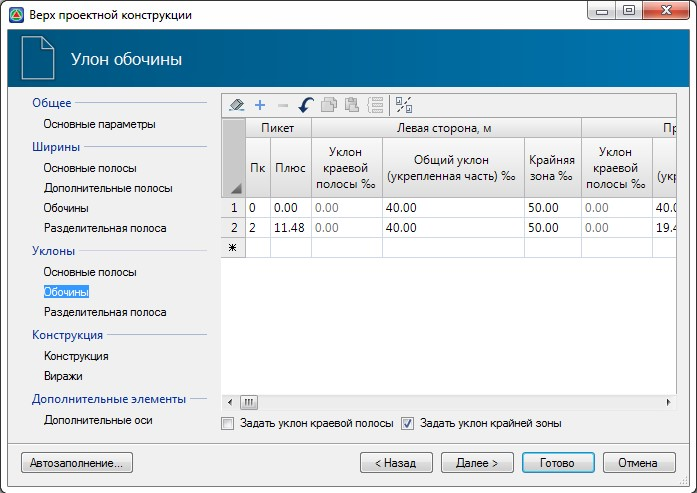

# Уклон обочины

 

В данной таблице задаются уклоны обочин слева и справа, и участок, в пределах которого действуют эти значения уклонов. При различных значениях уклонов на начальном и конечном участке, на промежуточных пикетах они будут рассчитываться линейной интерполяцией.

По умолчанию задается общий уклон обочины, который распространяется на уклон **Укрепленной части** (2-я зона) и **Крайней зоны** (3-я зона) обочины, а уклон **Краевой полосы обочины** (1-я зона) принимается равный уклону крайней полосы проезжей части.

Для задания уклона краевой полосы и крайней зоны обочины отличного от основной проезжей части и общего уклона обочины соответственно, необходимо установить опцию **Задать уклон краевой полосы** и **Задать уклон крайней зоны**. После этого в данной таблице станут активны соответствующие столбцы, где можно задать необходимые значения уклонов.