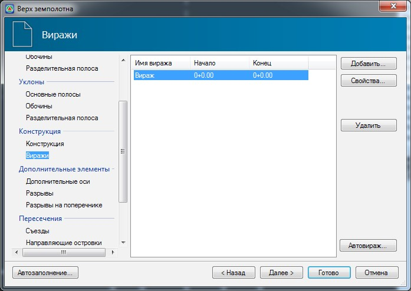

# Виражи

 

Возможно два варианта заполнения таблицы виражей - в автоматическом и ручном режимах. Вначале рассмотрим [автоматический](avtovirazh.md) режим создания виража, а затем уже [общий случай](general_case_creating_superelevation.md).
