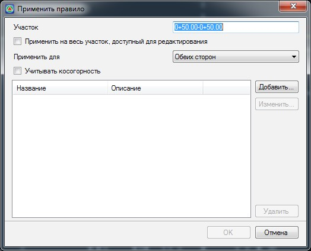
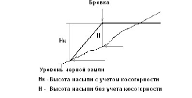
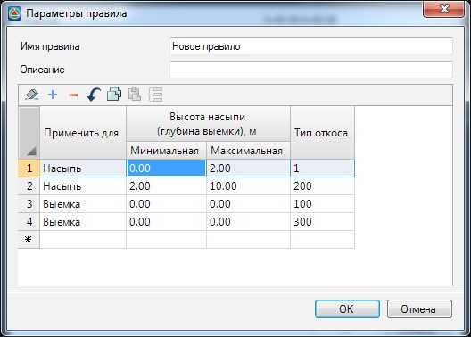
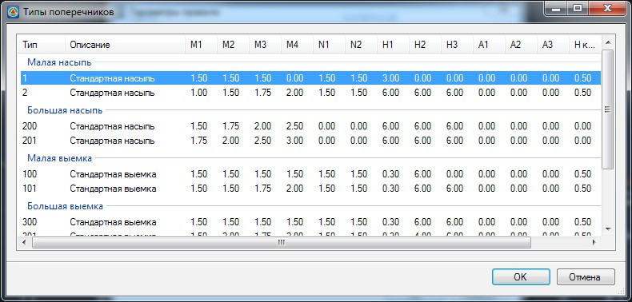

# Использование правил

Самый простой и эффективный способ автоматического назначения типов откосов поперечников – это применение правил, согласно которым программа определит требуемый номер типа, в зависимости от разности отметок бровки проектного поперечника и существующей земли.

Правило состоит из следующих элементов:

* предельная высота насыпи (от и до, м.).
* предельная глубина выемки. (от и до, м.).
* номер типового откоса для насыпи заданной высотной группы.
* номер типового откоса для выемки заданной глубинной группы.

Формально описание правила можно представить в следующем виде. Если рабочая отметка положительна и попадает в указанный высотный диапазон, то на данном поперечнике, на соответствующей стороне применяется заданный типовой откос насыпи. Если рабочая отметка отрицательна и попадает в указанный диапазон глубин, то на этом участке применяется соответствующий типовой откос выемки.

Чтобы применить правило выберите элемент меню **Поперечник – Применить правило**.

Откроется диалоговое окно:

**Участок** – в данном поле задаются границы участка, на котором будет применено правило. По умолчанию, при открытии окна, программа предлагает применить правило на текущем поперечнике.

**Применить на весь участок доступный для редактирования** – установление данной опции задает весь доступный для редактирования участок трассы для применения правила.

**Применить для** – из выпадающего списка выберите сторону, для которой должно быть применено правило. По умолчанию правило применяется для обоих сторон.

**Учитывать косогорность** – отметка насыпи вычисляется под бровкой проектного поперечника по вертикали. Если же данная опция установлена, то высота насыпи будет рассчитываться как разность между отметкой бровки проектного поперечника и отметкой подошвы насыпи:

В нижней части данного окна показан список предварительно созданных правил, находящихся в текущем проекте. Для создания нового правила нажмите кнопку **Добавить**. Откроется окно **Параметры правила**:

**Имя правила/Описание** – данные поля являются информационными и необязательными для заполнения.

**Применить для** – из выпадающего списка выберите тип участка, для которого будет задана соответствующая высота насыпи или глубина выемки.

**Высота насыпи (глубина выемки),м** – значение диапазона высот или глубин для данного участка правила.

**Тип откоса** – в данном поле задается номер типового откоса, который должен соответствовать данному участку правила. Откос может быть выбран непосредственно из типовой библиотеки.

Для этого щелкните левой кнопкой по данному полю, появится кнопка , нажмите ее. В результате откроется окно **Типы поперечников**:

Выберите требуемый типовой откос и нажмите **Ок**.

Для применения правила или группы правил на заданных участках нажмите **ОК**.

В результате программа применит правила и на соответствующих участках автоматически применит типовые откосы.