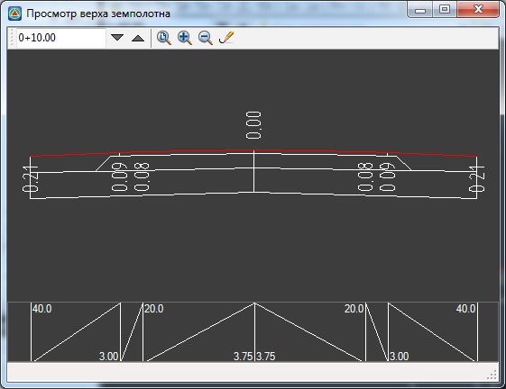

# Просмотр верха конструкции

Для отслеживания изменений параметров конструкции также предусмотрен специальный режим. Для перехода в него выполните следующие действия:

1. Выберете элемент меню **Поперечник – Просмотр верха конструкции**. Откроется окно просмотра:

   

2. Для перемещения по списку поперечников последовательно нажимайте **Page Up** или **Page Down** или вводите необходимый пикет непосредственно в селекторе поперечников.
3. Для выхода из этого режима просто закройте данное окно.