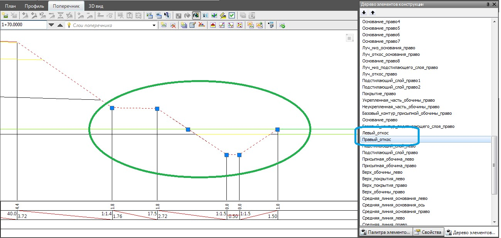

# Визуальное редактирование откоса

Имеющийся функционал позволяет редактировать конструкцию откосов путем визуального перемещения характерных точек откоса с помощью левой кнопки мыши. Для этого необходимо в **Палитре конструкций** выбрать элемент **Правый\ Левый откос**, появятся грипы (вершины)  , выбрав необходимый грип (вершину) произведите редактирование:

