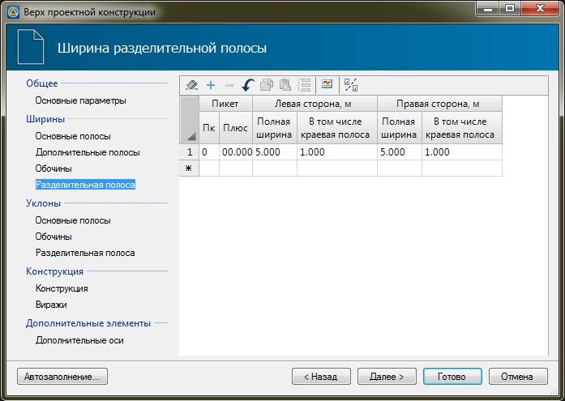

# Ширина разделительной полосы

 

В данной таблице указываются значения ширин разделительной полосы, а также границы участков, в пределах которых действуют эти значения. При различных значениях ширин на начальном и конечном участке, на промежуточных пикетах они будут рассчитываться линейной интерполяцией.

Для разделительной полосы помимо ее полной ширины, также в соответствующих полях задается ширина краевой зоны (она включается в общую ширину разделительной полосы).