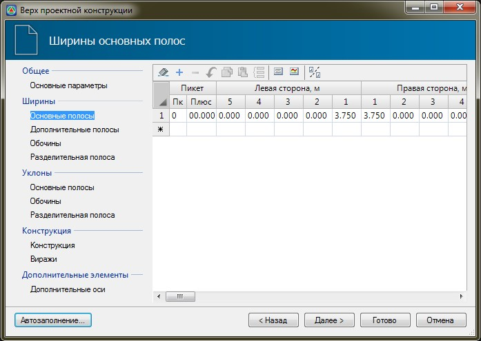
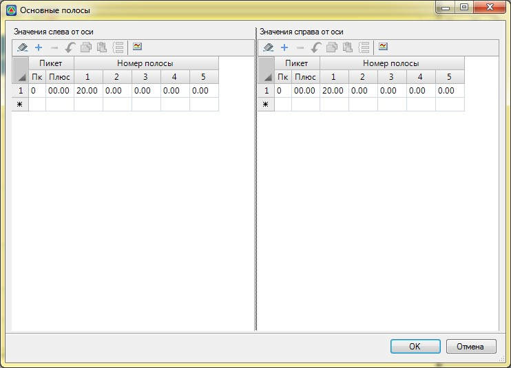

# Ширины основных полос

В данной таблице задается ширина основных полос проезжей части слева и справа, и участок, в пределах которого действуют эти значения ширин полос. При различных значениях ширин на начальном и конечном участке, на промежуточных пикетах они будут рассчитываться линейной интерполяцией.



 Рекомендуется в данной таблице задавать именно ширины основной проезжей части, без учета уширений на виражах, переходно-скоростных полос на пересечениях, карманов остановок и т.п., т.к. эти элементы задаются в других вкладках мастера.



Копка  на панели окна позволяет задавать значения **Ширин** и **Уклонов Основных полос**, **Обочин** и **Разделительной полосы** отдельно для каждой стороны дороги:

