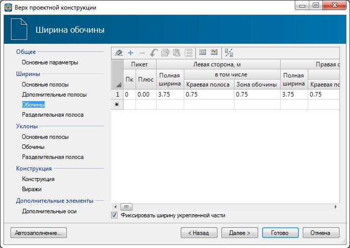

# Ширина обочины

 

В данной таблице указываются значения ширин обочин, а также границы участков, в пределах которых действуют эти значения. При различных значениях ширин на начальном и конечном участке, на промежуточных пикетах они будут рассчитываться линейной интерполяцией.



 Обочина состоит из трех основных зон – краевая полоса (1-я зона), укрепленная часть (2-я зона) и неукрепленная зона (т.е. 3-я зона или укрепленная засевом трав). В данной таблице задается полная ширина обочины, ширина первой зоны и опционально ширина второй или третьей зоны. Т.е. если включена опция Фиксировать ширину укрепленной части, то в поле Зона обочины задается ширина второй зоны, если выключена, то ширина третьей зоны обочины. Ширина одной из зоны обочины вычисляется по остаточному принципу, т.к. обочина на определенных участках может иметь переменную полную ширину (к примеру, на участках уширения проезжей части на виражах).



Полная ширина обочины также может быть заполнена таким образом, чтобы ее значения совпадали с существующей шириной обочины. Для это воспользуйтесь пиктограммой **Назначить ширины по существующей**, расположенной в верхней части окна. Данная функция была описана выше, в разделе **Основные полосы**.

Полная ширина обочины также может быть определена как разность двух выбранных смещений. Для это воспользуйтесь пиктограммой **Назначить ширину по смещениям**, расположенной в верхней части окна. Данная функция была описана выше, в разделе **Ширины основных полос**.