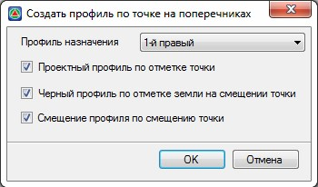

# Создание профиля по точке на поперечнике

Функция позволяет по любой узловой точке поперечного профиля (по точке с кодом черного поперечника или по узлу проектной конструкции) определить ее смещение (относительно оси), создать черный профиль и автоматически запроектировать проектный профиль.

В дальнейшем автоматически созданный проектный профиль может быть использован для отображения по нему данных вертикальной планировки – отметок, продольных и поперечных уклонов, а также при необходимости привязки к нему соответствующего узла конструкции. Т.е. по сути, работа функции аналогична функции по Созданию профилей кюветов, за тем отличием что профиль, может быть создан по любому узлу, а не только по узлу центра дна водоотводного сооружения.

Для создания продольного профиля по узлу:

1. Выберите меню **Поперечник – Утилиты – Создать профиль по точке на поперечниках**, курсор примет форму прицела, указав необходимый узел поперечного профиля, откроется диалоговое окно:

   

   В соответствующем селекторе выберите профиль назначения, в который опционально могут быть записаны все необходимые данные – смещение, черный и проектный профиль.

2.Выполните необходимые настройки и нажмите **ОК**. В результате по выбранной узловой точке поперечника будет построен продольный профиль.