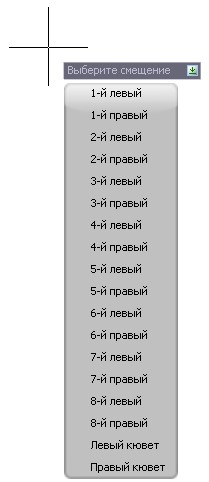
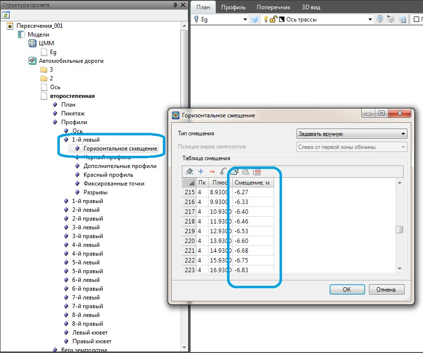
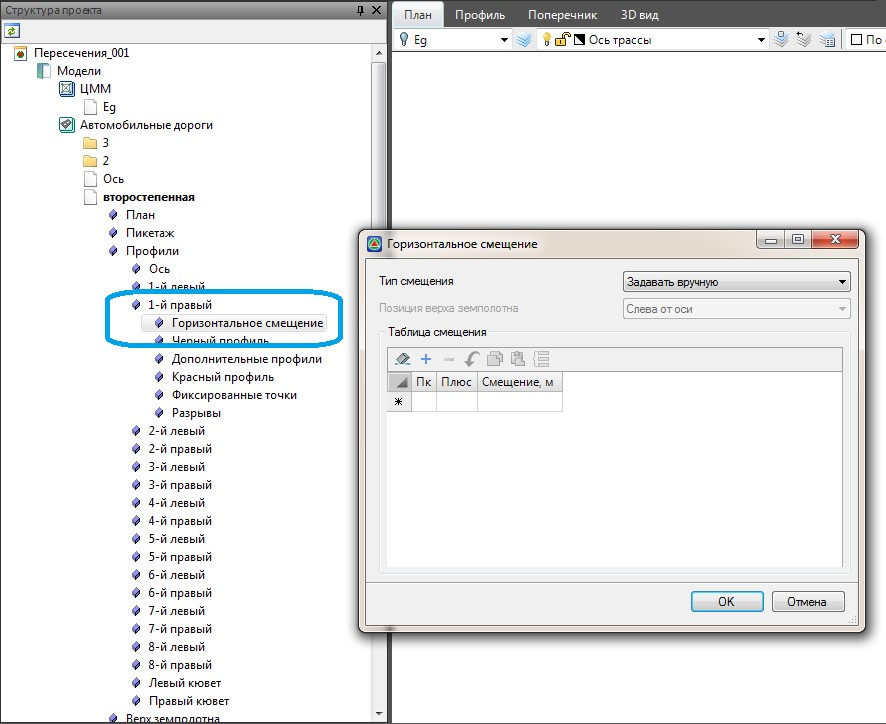
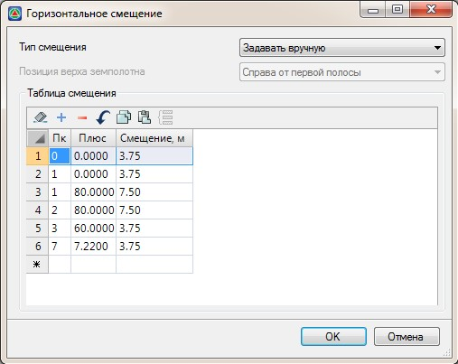
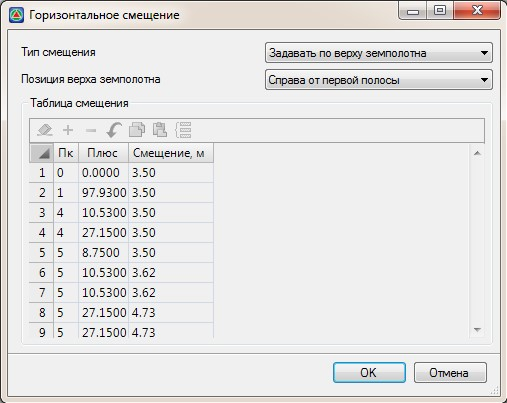

# Создание смещений

Смещениями являются линии проходящие вдоль трассы на некотором расстоянии от нее, описывающие характерные элементы дороги (кромки, газоны, локальные проезды и т.п.).



Данные линии могут быть получены как средствами Robur так и импортированы из других программ (например AutoCAD).



При определении смещений, данные о расстоянии между линией смещения и текущей трассой записывается в специальную таблицу **Горизонтальное смещение**.

При наличии заполненной таблицы смещений имеется возможность построить дополнительные профили (8 справа и 8 слева относительно оси), которые могут быть использованы например для проектирования поперечных профилей.

В **Robur** предусмотрены два способа создания смещений: из линейных объектов (отрезки, полилинии, структурные линии и т.д.) и с помощью специальной таблицы.

* Для определения смещений из линейных объектов:

1. Выберите меню **План - Заполнить таблицу смещений**.
2. Из появившегося списка выберите необходимое смещение, например 1-й левый:

   

3. Курсор примет форму прицела, укажите линейный объект:

   

4. В результате, с необходимым шагом, будет рассчитано расстояние между выбранным линейным объектом и трассой. Эти данные программа заполнит в соответствующую таблицу **Горизонтальное смещение**:

   

   

   Смещения определяемые слева относительно трассы имеют отрицательные значения.

   

* Для определения смещений с помощью таблицы:

1. В **Структуре проекта** откройте таблицу **Горизонтальное смещение**, раскрыв дерево объектов **Подобъект - Профили - необходимую таблицу профиля смещения** (например 1-й правый):

   

2. Открывшуюся таблицу **Горизонтальное смещение** можно заполнить двумя способами, для этого в выпадающем списке **Тип смещения** выберите соответствующую опцию:

   **Задать вручную** - выбрав данную опцию, заполните таблицу, указывая пикет и значение смещения:

   

   

   Смещения определяемые слева относительно трассы имеют отрицательные значения.

   

   **Задать по верху земполотна** - выбрав данную опцию, имеется возможность заполнить таблицу по основным элементам верха проектной конструкции (границы основных полос, обочин и т.д.), для этого в селекторе **Позиция верха земполотна** выберите необходимую опцию. и нажмите **Ок**. В результате программа автоматически заполнит таблицу **Горизонтальное смещение**:

   