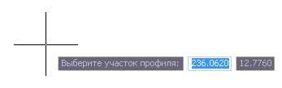
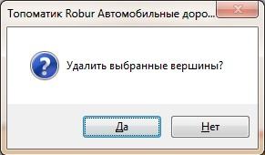

# Удаление вершин профиля

Функция предназначена для удаления группы вершин в пределах выбранной области.

Для этого:

1. Выберите меню **Профиль - Удалить вершины**, курсор примет форму прицела:

   

2. После выделения секущей рамкой области продольного профиля на которой необходимо удалить вершины откроется диалоговое окно:

   

3. Нажмите **Да**, в результате программа на выделенном участке удалит вершины продольного профиля.