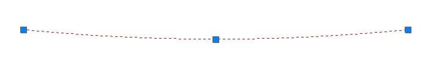
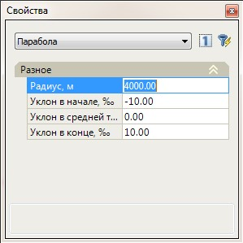

# Редактирование элементов

Данный функционал позволяет осуществлять редактирование созданных элементов: перемещать их визуально с помощью мыши, изменять параметры через окно **Свойства**, выполнять сопряжения, обрезку элементов и перемещение их по касательной.

Для этого:

Выделите нужный элемент (**Отрезок** или **Параболу**), нажав левой кнопкой мыши на грип (вершину) имеется возможность визуально изменить положение элемента:

Изменить параметры выделенного элемента можно через окно **Свойства**:

Также редактирование элементов может осуществляться с помощью функций из меню Редактировать - основные функции: **Удалить, Копировать,** **Перенести** и **Повернуть**.