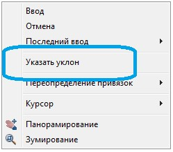
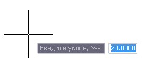
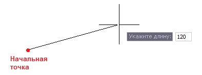
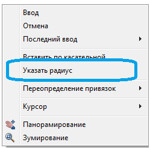
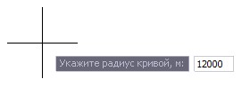
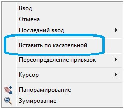
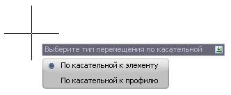
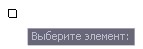
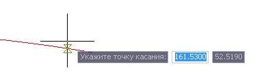

# Ввод элементов

Линия проектного продольного профиля может состоять из двух элементов: **Отрезков** и **Парабол**.

Для создания элементов:

1. Выберите меню **Профиль - Построения - Добавить отрезок\параболу**, курсор примет форму прицела: Далее ввод элементов может осуществляться несколькими способами:

* **Визуальный способ** -дальнейший ввод элементов осуществляется путем визуального указания левой кнопкой мыши начальной, конечной и средней (для параболы) точек создаваемых элементов.
* **Параметрическое создание элементов** - дальнейший ввод элементов осуществляется путем указания в **Динамической строке** ввода значений **Уклона** и **Длины** (для отрезка), **Радиуса** и **Уклона начальной точки** (для параболы).

## Для создания отрезка заданного уклона и длины:

1. Укажите в графическом поле окна **Профиль** начальную точку отрезка и нажмите правой кнопкой мыши, в контекстном меню выберите **Указать уклон**:

   

2. В **Динамической строке** ввода укажите значение уклона отрезка:

   

3. В **Динамической строке** ввода укажите длину отрезка:

   

В результате будет создан элемент **Отрезок**, который отобразится в окне **Профиль**.

## Для создания параболы заданного радиуса:

1. Нажмите правой кнопкой мыши, в контекстном меню выберите пункт **Указать радиус**:

   

2. В **Динамической строке** ввода укажите значение **Радиуса**:

   

В результате будет создан элемент **Парабола заданного радиуса**.

## Для создания параболы с заданным уклоном в начальной точке:

1. После указания начальной и конечной точек параболы нажмите правой кнопкой мыши, в контекстном меню выберите **Указать уклон**:

   

2. В **Динамической строке** ввода укажите значение **Уклона в начальной точке**:

   

В результате будет создан элемент **Парабола с заданным уклоном** в начальной точке.

* **Ввод элементов по касательной**.

Указывается точка касания на элементе (отрезке, параболе) или проектном профиле.

## Для ввода элемента по касательной:

a. Нажмите правой кнопкой мыши, в контекстном меню выберите **Вставить по касательной**:

   

b. В зависимости от того на каком элементе будет указана точка касания, выберите один из вариантов ввода:

   

   **По касательной к элементу** - выбор данной опции позволяет указать точку касания на элементе **Отрезок** или **Парабола**.
   **По касательной к профилю** - выбор данной опции позволяет указать точку касания на проектном профиле.

c. Выберите необходимый тип построения, курсор примет форму прицела, выберите элемент:

   

   и точку касания на данном элементе:

   

2. Выбрав один и способов построения элементов завершите ввод.