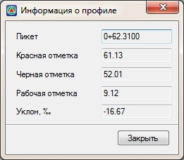

# Информация об элементе

Функция предназначена для отображения информации по выбранному элементу в указанной точке.

Для этого:

1. Выберите меню **Профиль - Построения - Информация о элементе,** курсор примет форму прицела, укажите элемент.
2. Укажите точку на данном элементе. В результате в открывшемся диалоговом окне программа отобразит информацию о параметрах элемента в указанной точке:

   