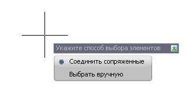

# Вставить элементы в профиль

Функция предназначена для вставки одного или группы сопряженных элементов в линию продольного профиля.

Для этого:

1. Выберите меню **Профиль - Построения - Вставить элементы в профиль**:

   

   * **Соединить сопряженные** - функция позволяет автоматически добавить сопряженные элементы в линию продольного профиля, указав только начальный и конечный элементы из данной группы.
   * **Выбрать вручную** - при выборе данной функции необходимо последовательно левой кнопкой мыши (удерживая клавишу **Shift**) указать элементы, которые необходимо добавить в линию продольного профиля.
2. Выберите один из способов и укажите необходимые элементы, которые необходимо добавить в линию продольного профиля.

В результате линия проектного профиля будет модифицирована за счет добавленных в нее элементов.