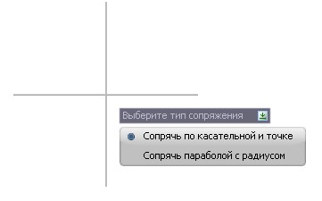
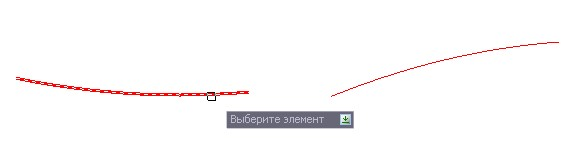
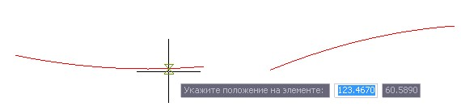
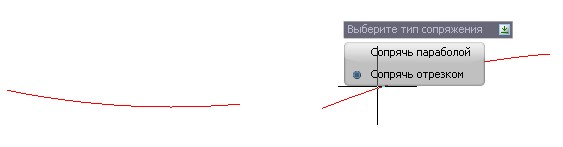
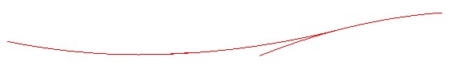
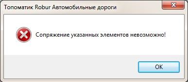
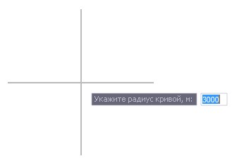

# Сопрячь элементы

Функция предназначена для сопряжения между собой двух элементов параболой или отрезком.

Для этого:

Выберите меню **Профиль - Построения - Сопрячь элементы**, откроется диалог выбора типа сопряжения:

* Выбрав вариант сопряжения **Сопрячь по касательной к точке**, необходимо выполнить следующую последовательность действий:

  

1. Укажите точку сопряжения на первом элементе:

   

2. Укажите второй элемент с которым необходимо выполнить сопряжение:

   

   * **Сопрячь параболой** - при выборе данной опции сопряжение будет произведено параболой.
   * **Сопрячь отрезком** - при выборе данной опции сопряжение будет произведено отрезком.
    
3. Выберите необходимый тип элемента. В результате программа произведет сопряжение выбранным элементом:

   

   

   Примечание. При невозможности выполнения сопряжения откроется предупреждающее окно:!

   

   

* Выбрав вариант сопряжения **Сопрячь параболой с радиусом**, необходимо выполнить следующую последовательность действий:

  

1. Задайте радиус кривой и нажмите **Enter**.
2. Выберите первый элемент, с которым необходимо выполнить сопряжение. В качестве данного элемента может быть указана либо линия профиля либо предварительно созданный элемент (отрезок или парабола).
3. Выберите второй элемент для сопряжения. В результате программа произведет сопряжение выбранным элементом.