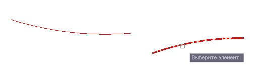
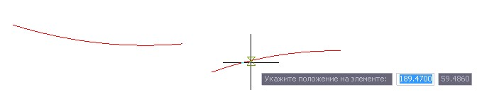
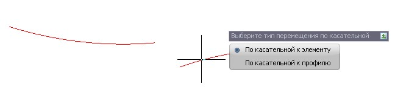
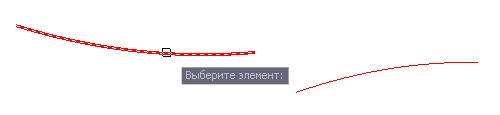
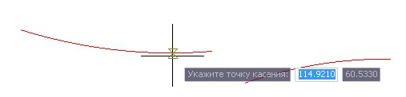
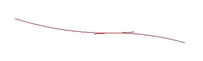

# Переместить по касательной

Функция позволяет произвести перемещение выбранного элемента по касательной к другому элементу или линии продольного профиля.

Для этого:

1. Выберите меню **Профиль - Построения - Переместить по касательной**, курсор примет форму прицела, укажите левой кнопкой мыши перемещаемый элемент:

   

2. Укажите левой кнопкой мыши точку на перемещаемом элементе:

   

3. В зависимости от того на каком элементе будет указана точка касания, выберите один из вариантов ввода:

   

4. В зависимости от выбранного варианта в п.3, выберите либо другой элемент или укажите точку касания на линии продольного профиля:

   

5. Укажите точку касания на втором элементе:

   

6. В результате программа произведет перемещение выбранного элемента по касательной к другому элементу или линии продольного профиля:

   