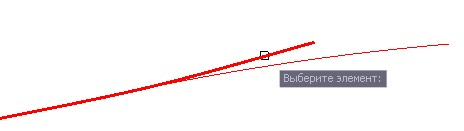
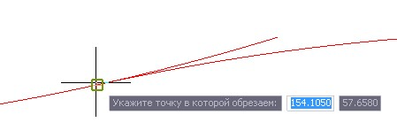
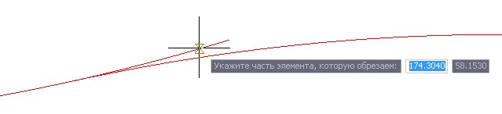
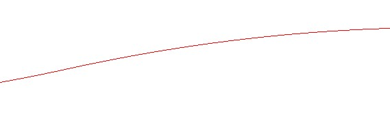

# Обрезать элемент

Функция позволяет произвести обрезку элемента в заданной точке.

Для этого:

1. Выберите меню **Профиль - Построения - Обрезать элемент**, курсор примет форму прицела, укажите обрезаемый элемент:

   

2. Укажите левой кнопкой мыши точку по которой необходимо обрезать элемент:

   

3. Укажите левой кнопкой мыши часть элемента, которую необходимо обрезать:

   

В результате программа обрежет указанную часть элемента в заданной точке:
