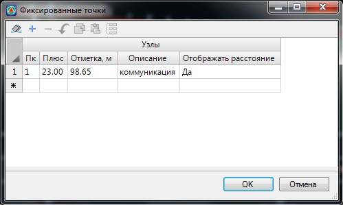
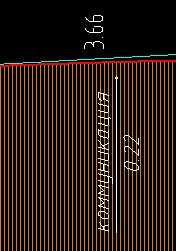

# Фиксированные точки

Данная функция позволяет на продольном профиле, на заданных пикетах и отметках отобразить точки, которые могут описывать различные инженерные сооружения, например путепроводы, мосты, коммуникации, дождеприемные колодцы и т.п.

Для отображения фиксированной точки на профиле:

1. Выберите меню **Профиль - Фиксированные точки**, откроется диалоговое окно:

   

2. В соответствующих полях ввода задайте **Пикет, Отметку** и **Описание точки**. Опция **Отображать расстояние** позволяет динамически отображать расстояние от контрольной точки до проектной линии.
3. Введите необходимые значения и нажмите **ОК**. В результате, фиксированная точка отобразится в окне профиль:

   
