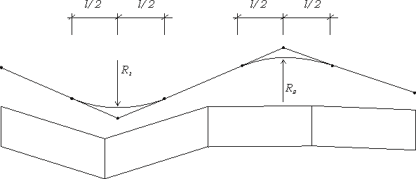
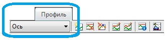

# Общие положения

Программа **Топоматик Robur** содержит исчерпывающий набор функций для создания и редактирования продольного профиля. Имеется возможность создавать продольный профиль различными способами, начиная от ручного поэлементного создания профиля и заканчивая автоматизированными способами построения проектной линии, например, по руководящей отметке или возможность построения одного профиля относительно другого.

Функционал позволяет контролировать видимость в прямом и обратном направлении, а также соблюдение геометрических параметров (минимальные радиусы, длины элементов, разницу уклонов и т.д.) продольного профиля. Для проектирования профиля в городских условиях имеется специализированный набор функций для автоматического создания пилообразных продольных профилей по водоотводным лоткам.

В программе **Топоматик Robur** продольный профиль представляет собой набор вершин, в которые вписаны вертикальные параболические кривые, т.е. основным методом проектирования продольного профиля является классический способ проектирования кривыми Н. М. Антонова.



 В качестве второстепенного способа проектирования проектной линии имеется функционал позволяющий проектировать проектную линию сплайновым методом.



**Robur** позволяет в одном подобъекте иметь до 19 продольных профилей:
* по оси трассы.
* 8 слева.
* 8 справа.
* левый кювет.
* правый кювет.

В процессе работы один из профилей является текущим, то есть профилем, над которым выполняются операции редактирования. Выбор текущего профиля осуществляется при помощи селектора профилей, расположенного в окне **Профиль**.

Возможность создания нескольких продольных профилей позволяет привязать к ним и производить проектирование различных водоотводных, а также конструктивных элементов дороги (например лотки, верх бортового камня, край газона, тротуара и т.д.) с помощью профилей, что существенно облегчает решение задач по проектированию объектов в городских условиях.