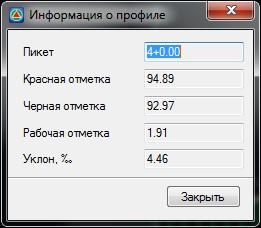

# Информация о профиле

Функция предназначена для получения информации по профилю в любой его указанной точке.

Для этого:

1. Выберите меню **Профиль - Информация о профиле**, курсор примет форму прицела;
2. Перемещая курсор по профилю, визуально укажите точку, либо точно укажите пикет, задав его значение в строке динамического ввода, и нажмите **Enter**, откроется диалоговое окно с информацией по профилю:

   

3. Для выхода из данного окна нажмите кнопку **Закрыть**.



 Информация по профилю также всегда отображается в динамической информационной строке в нижней части окна Профиль.

