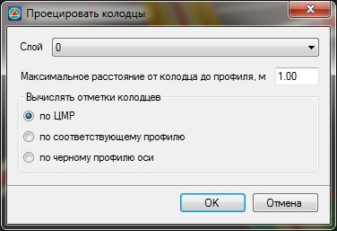

# Проецировать колодцы

При наличии специального слоя, содержащего информацию о колодцах, программа позволяет отобразить их положение на продольном профиле. Для этого:

1. Выберите элемент меню **План – Проецировать колодцы**, откроется диалоговое окно:

   

   В поле **Слой** укажите слой, содержащий информацию о колодцах.

   

   1. Обозначение колодцев должно быть текстовым и находиться в отдельном слое.
   2. При проецировании колодца на продольный профиль, его пикетажное значение определяется по точке вставки текста.

   

   В пункте **Максимальное расстояние** от колодца до профиля укажите расстояние поиска от соответствующего профиля. Все колодцы, которые попали в заданную полосу поиска, будут автоматически спроецированы на соответствующий продольный профиль.

   В поле **Вычислять отметки колодцев** укажите необходимый способ вычисления положения колодцев. Имеется три основных способа вычисления отметок:

    * **по ЦММ** (цифровая модель рельефа) – программа рассчитывает отметки колодцев и отображает их на соответствующем профиле. Отметка колодца снимается с ЦММ.
   * **по соответствующему профилю** - программа рассчитывает отметки колодцев и отображает их на соответствующем профиле. Отметка колодца берется с черного профиля соответствующего смещения.
   * **по черному профилю оси** - программа рассчитывает отметки колодцев и отображает их на соответствующем профиле. Отметка колодца берется с черного профиля по оси.

2. Задайте необходимые параметры и нажмите **Ок**. В результате программа спроецирует колодцы отобразив их на профилях соответствующими условными знаками.