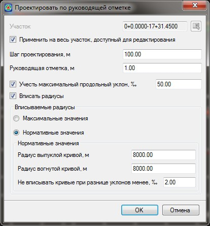

# Проектировать профиль по руководящей отметке

**Robur** позволяет автоматически запроектировать участок продольного профиля по критерию минимального отклонения от руководящей отметки:

Для этого:

1. Выберите меню **Профиль - Проектировать по руководящей отметке**, откроется диалоговое окно: 

   

   **Применить на весь участок, доступный для редактирования** - по умолчанию профиль создается на всю трассу, при отключении данной опции появится возможность задать участок проектирования. Участок можно задать непосредственно в поле ввода или указать графически при помощи соответствующей кнопки.

   **Шаг проектирования** – определяет минимальное значение между вершинами продольного профиля. Фактическое значение будет зависеть от рельефа местности. Положение вершин вычисляется при помощи специального алгоритма по методу наименьших квадратов.

   

   Меньший шаг проектирования приведет к построению проектной линии с большим количеством элементов, в результате отклонение от заданной рабочей отметки будет наименьшим. И наоборот, больший шаг проектирования приведет к меньшему количеству элементов профиля и большему отклонению проектной линии от заданной рабочей отметки.

   

   **Учесть максимальный продольный уклон** - при включении данной опции величина продольного уклона элементов профиля будет не более заданной величины в соответствующем поле ввода.

   **Вписать радиусы** - включение данной опции приведет к автоматическому вписыванию вертикальных кривых. Причем значения радиусов вписанных кривых могут определяться исходя из выбранного условия:

   * Опция **Максимальные значения** - будут вписываться кривые максимально возможного радиуса.

   * Опция **Нормативные значения** - будут вписываться кривые не менее нормативных радиусов, указанных в соответсвующих полях ввода .

    

   **Не вписывать кривые при разнице уклонов менее** - задается допустимое значение разницы уклонов, при превышении которого будет разрешено автоматически вписывать кривые. Если разница уклонов будет меньше указанной, то кривая вписываться не будет, а  на профиле останется перелом.