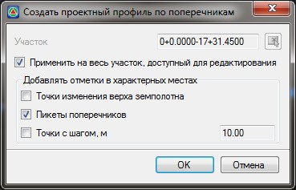

# Проектировать профиль по поперечникам

Функция позволяет запроектировать продольный профиль по проектному поперечнику (по линии с кодом 514) с привязкой к любому элементу верха конструкции, например по границам основных полос, кромкам или бровкам и т.д.



 Предварительно должно быть определено положение линии смещения, по которой будет строиться продольный профиль. Данный функционал описан в разделе [Создание смещений](creating_offsets.md).



Для этого:

1. Выберите меню **Профиль - Проектировать по поперечникам**, откроется диалоговое окно:

   

   **Применить на весь участок, доступный для редактирования** - по умолчанию профиль строится на всю трассу, при отключении данной опции появится возможность задать участок проектирования. Участок можно задать непосредственно в поле ввода или указать графически при помощи соответствующей кнопки.

   **Добавлять отметки в характерных местах** - включение дополнительных опций позволяет в характерных местах создавать дополнительные вершины, которые будут добавлены в линию продольного профиля.

   

   Отметки дополнительных вершин будут вычислены путем создания фиктивного проектного поперечника в месте вычисления характерной точки.

   

2. Выполните необходимые настройки и нажмите **Ок**. В результате программа запроектирует продольный профиль по проектным поперечника согласно местоположению заданной линии смещения для проектируемого профиля и выбранным настройкам.