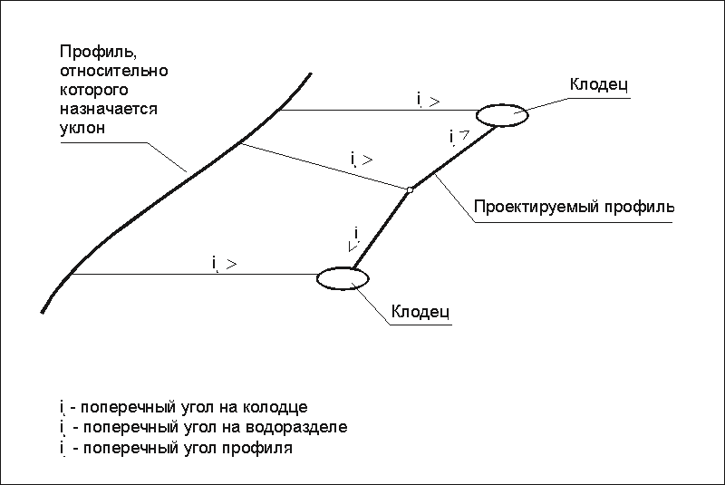
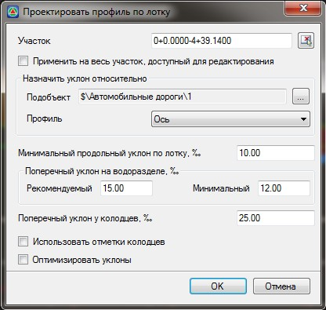

# Проектировать лоток

Функция используется при проектировании в городских условиях улиц с плоским рельефом (продольный уклон близкий к нулю), так как при необеспеченном продольном уклоне возникают проблемы отвода воды с проезжей части. Данная функция позволяет автоматически запроектировать продольный профиль по лотку с учетом имеющихся дождеприемных колодцев и обеспечения продольных уклонов. А в случае если продольный уклон по лотку недостаточен для естественного тока воды, то профиль лотка проектируется пилообразным.

Для сбора воды предусматривают дождеприемные лотки и колодцы. Если продольный уклон по лотку недостаточен для естественного тока воды, то профиль лотка проектируют пилообразным. В таком случае, поперечный уклон дороги будет переменным. Максимальное значение поперечного уклона достигается у водоприемных колодцев, а минимальное – у водоразделов.

Для проектирования профиля по лоткам:

1. Выберите меню **Профиль - Проектировать лоток**, откроется диалоговое окно:

   

   **Применить на весь участок, доступный для редактирования** - по умолчанию профиль строится на всю трассу, при отключении данной опции появится возможность задать участок проектирования. Участок можно задать непосредственно в поле ввода или указать графически при помощи соответствующей кнопки.

   **Назначить уклон относительно** - с помощью данной функции имеется возможность выбрать профиль другой модели относительно которой будет назначаться уклон. Для этого выберите кнопку  , откроется диалоговое окно:

   

   В открывшемся окне выберите необходимую модель подобъекта, профиль которой необходимо использовать в качестве ссылки, нажмите **ОК**.

   **Профиль** - из выпадающего списка выберите профиль, относительного которого назначаются поперечные уклоны.

   **Минимальный продольный уклон по лотку** - задается минимальное значение продольного уклона вдоль лотка. Если продольный уклон между колодцами менее данного значения, то на профиле будет создан водораздел.

   **Поперечный уклон на водоразделе** - задает **Рекомендуемое** и **Минимальное значение** поперечного уклона на водоразделе. Эти значения используются в том случае, если включена опция **Оптимизировать уклоны**. Т.е. при включении оптимизации уклонов программа будет стремиться к обеспечению рекомендуемого уклона на водоразделе (в случае если расчетное значение поперечного уклона на водоразделе больше рекомендуемого или попадает в диапазон минимального и рекомендуемого значения) за счет увеличения продольного уклона по лоткам.

   **Оптимизировать уклоны** – при включении данной опции программа будет стремиться подобрать максимальное значение продольного уклона по лотку и рекомендуемое значение поперечного уклона на водоразделе, при выключенной опции продольные уклоны по лотку принимаются равными значению, заданному в поле **Минимальный продольный уклон** по лотку.

   **Поперечный уклон у колодцев** - задается значение поперечного уклона у водоприемных колодцев. Данное поле ввода используется только в том случае, если не включена опция использования отметок колодцев.

   **Использовать отметки колодцев** - опция задает режим привязки профиля к отметкам колодцев, независимо от значения в поле **Поперечный уклон** у колодцев.

   

   В качестве дождеприемных колодцев на продольном профиле являются фиксированные точки, которые должны находится в соответствующей [таблице](fixed_dots.md). Процедура задания положения дождеприемных колодцев для их отображения на профиле описана в соответствующем [разделе](project_wells.md).

   

2. Задайте необходимые настройки и нажмите **Ок**. В результате программа запроектирует продольный профиль по лотку с заданными параметрами.