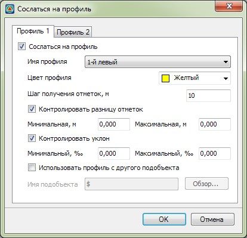
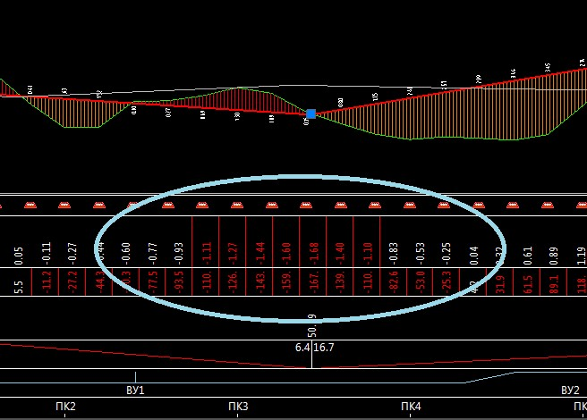
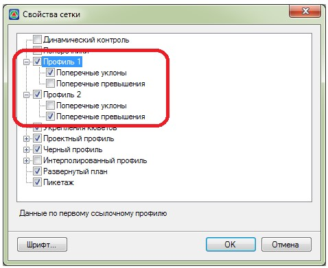
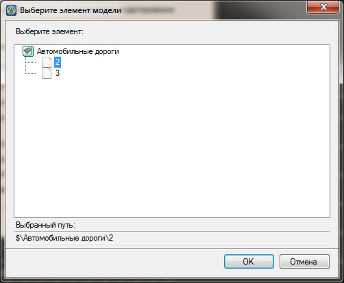

# Сослаться на профиль

Опция предназначена для наглядного отображения положения текущего профиля относительно другого профиля, с возможностью вывода между ними разницы отметок и значений поперечного уклона. Все необходимые параметры могут быть отображены по двум профилям.

Для того чтобы отобразить другой продольный профиль:

1. Выберите меню **Профиль - Сослаться на профиль**, откроется диалоговое окно:

   

   **Сослаться на профиль** - включение\отключение режима отображения линии другого профиля.

   **Имя профиля** - из данного выпадающего списка выбирается профиль, который необходимо отобразить в виде ссылки. К примеру, при проектировании профиля левой канавы можно отслеживать, как ее профиль проходит относительно профиля правой канавы.

   **Шаг получения отметок** - в данном поле укажите шаг точек ссылочного профиля, по которым будут вычисляться отметки. Меньший шаг позволяет более точно отобразить линию профиля, однако расчет протяженного профиля может занять определенное время. Соответственно, больший шаг, приведет к менее точному отображению данной линии, но более быстрому ее расчету и отрисовки.

   **Контролировать разницу отметок** - включение данной опции позволяет контролировать заданные в соответствующих полях ввода минимальную и максимальную разницу отметок, между проектной линией текущего профиля и линией выбранного ссылочного профиля, выделяя красным цветом значения превышающие заданные величины.

   **Контролировать уклон** - включение данной опции позволяет контролировать заданные в соответствующих полях ввода минимальный и максимальный поперечный уклон, между проектной линией текущего профиля и линией выбранного профиля, выделяя красным цветом значения превышающие заданные величины. 

   

   

   В Свойствах панели продольного профиля должны быть установлены опции напротив элементов Поперечные превышения и Поперечные уклоны:

   

   

   **Использовать профиль с другого подобъекта** - включение\отключение режима отображения профилей других подобъектов. Для этого выберите кнопку **Обзор**, откроется диалоговое окно:

   

2. В открывшемся окне выберите необходимую модель типа **Автомобильная дорога**, профиль которой необходимо отобразить и нажмите **ОК**.
3. Нажмите **ОК**.

В результате программа отобразит в окне **Профиль** дополнительную линию - ссылочный профиль.