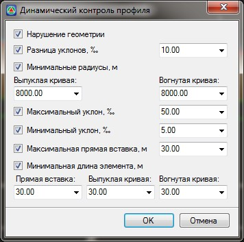
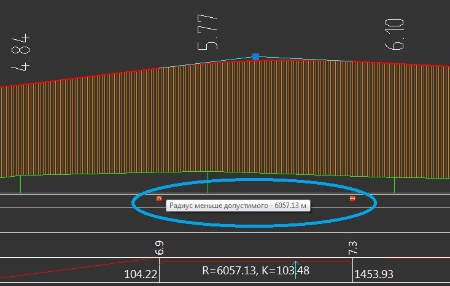
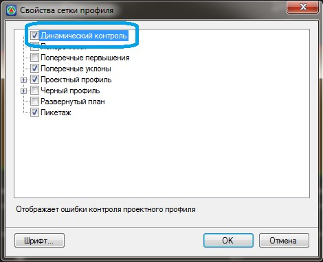

# Настройка контроля профиля

Данный функционал позволяет осуществить проверку элементов профиля на отклонение проектных величин от нормативных показателей. **Топоматик Robur** позволяет осуществить контроль за нарушением геометрии, превышением минимального значения радиусов вертикальных кривых, минимального значения длин элементов, максимального значения разницы уклонов и т.д.

Для настройки контролируемых значений проектного профиля:

1. Выберите меню **Профиль - Настройка контроля профиля**, откроется диалоговое окно:

   

   Поставьте галочки напротив тех параметров профиля которые необходимо контролировать, рядом выберите значение контролируемого критерия.

2. Задайте необходимые параметры и нажмите **Ок**. В результате в нижней части окна **Профиль** будут отображаться соответствующие значки, при наведении курсора мыши на значок отобразится подсказка о нарушении какого-либо из заданных критериев:

   

   

   Для отображения значков нарушения критериев контроля профиля, в Свойствах панели продольного профиля должна быть установлена галочка напротив элемента **Динамический контроль**:

   

   