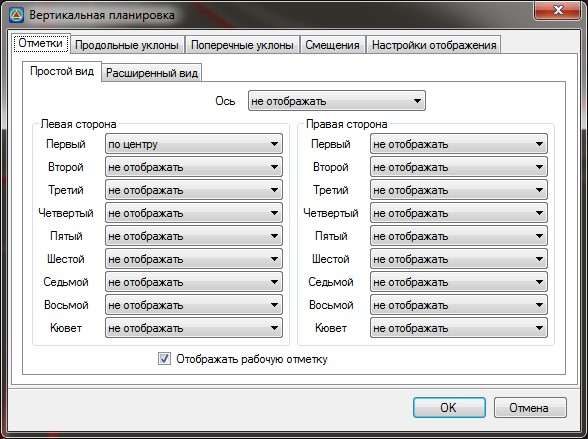
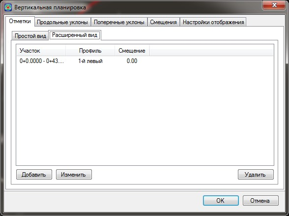
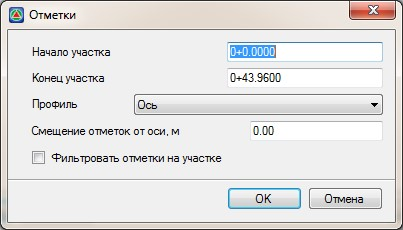
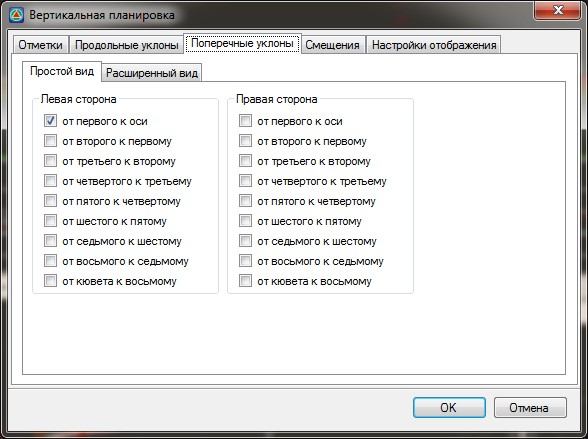
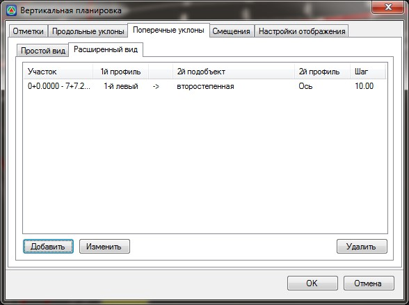
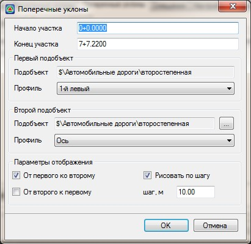
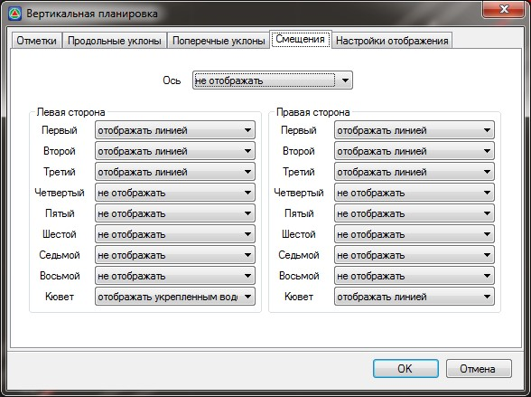
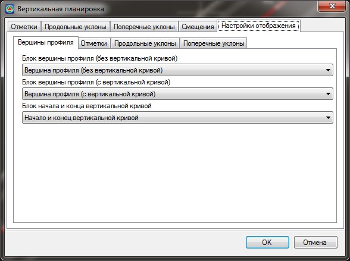

# Вертикальная планировка

Под термином **«вертикальная планировка»** подразумевается графическое отображение геометрии подобъекта, по умолчанию уклоноуказателями в виде направленных стрелок. По верху стрелки подписывается уклон, а по низу – расстояние.

Вертикальная планировка определяется в плане линиями смещений и продольными профилями смещений. Вершины вертикальных углов, границы тангенсов, вершин продольных профилей отображаются соответствующими условным значками.

* **Продольный уклон** – это уклон между соседними вершинами углов в одном продольном профиле.
* **Поперечный уклон** – это уклон между двумя продольными профилями.



 Если в вершину угла продольного профиля вписана вертикальная кривая, то отметка на вертикальной планировке будет равна отметке на вертикальной кривой, а не на вершине вертикального угла.



Функционал вертикальной планировки предоставляет возможность отобразить данные (отметки вершин, уклоны и т.д.) по выбранным продольным профилям, а также позволяет одновременно редактировать сразу несколько продольных профилей непосредственно в окне **План**, что существенно облегчает решение задач по проектированию объектов в городских условиях.

## Отображение вертикальной планировки

Имеющийся функционал позволяет отобразить в окне **План** данные вертикальной планировки (отметки вершин, уклоны и т.д.) по выбранным продольным профилям.

Для этого:

1. Выберите элемент меню **План - Вертикальная планировка**, откроется диалоговое окно:

   

   Диалоговое окно вертикальной планировки включает в себя пять основных вкладок: **Отметки, Продольные уклоны, Поперечные уклоны, Смещения** и **Настройки отображения**. У некоторых основных вкладок имеется дополнительный ряд вкладок (**Простой вид**, **Расширенный вид** и т.д.) предназначенный для расширенного отображения видимости заданных параметров вертикальной планировки, а также детальной ее настройки отображения.

 * Вкладка **Отметки** (дополнительная вкладка **Простой вид**) позволяет указать способ размещения на плане отметок вершин продольных профилей.

   Например, если в пункте **Левая сторона** в подпункте **Первый** из появившегося списка выбрать значение **Сместить вправо**, проектные отметки в плане будут расположены с правой стороны по ходу пикетажа от первого левого смещения. Если в пункте **Правая сторона** в подпункте **Первый** выбрать **Сместить влево**, проектные отметки в плане будут расположены с левой стороны по ходу пикетажа от первого правого смещения. Аналогичным образом указываются необходимое размещение отметок для оси и всех остальных смещений.

   **Отображать рабочую отметку** - включение данной опции позволяет рядом с проектной отметкой (в скобках) отобразить рабочие отметки.

 * Вкладка **Отметки** (дополнительная вкладка **Расширенный вид**):

   

   Заданные элементы отображения вертикальной планировки (**Отметки, Продольные и Поперечные уклоны**) на дополнительной вкладке (**Простой вид**) автоматически отображаются на дополнительной вкладке **Расширенный вид** в виде упорядоченного списка.

   На данной вкладке **Расширенный вид** имеется возможность отредактировать уже заданные участки отображения элементов вертикальной планировки или добавить новые участки, для этого:

   1. Нажмите кнопку **Добавить** для создания нового участка трассы, на котором необходимо добавить отображение элементов вертикальной планировки или выделите нужный участок и нажмите кнопку Изменить для редактирования имеющегося участка. Откроется диалоговое окно:

      

      **Начало и Конец участка** - определяет начало и конец участка на котором будут отображаться элементы вертикальной планировки.

      **Профиль** - выберите профиль по которому будут отображаться элементы вертикальной планировки.

      **Смещение отметок от оси** - поле ввода в котором указывается величина смещения элементов вертикальной планировки относительно выбранного профиля.

      

      Отрицательное значение сместит элементы влево по ходу пикетажа относительно линии смещения выбранного профиля, положительное значение, соответственно в право.

      

      **Фильтровать отметки на участке** - включение данной функции позволяет не отображать подписи отметок соответствующего профиля, на тех участках, где значения рабочих отметок равны или больше нуля. Т.е. фактически будут скрыты отметки на участках где отсутствуют водоотводные сооружения (кюветы, канавы).

   2. Произведите необходимые настройки и нажмите **Ок**.

  

 * Вкладка **Продольные уклоны** позволяет отобразит продольные уклоны по оси и выбранным профилям смещений и также имеет ряд дополнительных вкладок (**Простой** и **Расширенный вид**), принцип работы в которых аналогичен выше описанной вкладке **Отметки**.
 * Вкладка **Поперечные уклоны** (дополнительная вкладка **Простой вид**):

   

   С помощью вкладки **Поперечные уклоны** имеется возможность отобразить поперечные уклоны между выбранными профилями как в рамках одного подобъекта, так и между профилями смещений разных подобъектов.

   Для отображения поперечных уклонов между смежными профилями смещений в рамках текущего подобъекта на дополнительной вкладке **Простой вид** установите галочки напротив необходимых пунктов.

   * Дополнительная вкладка **Расширенный вид**:

     

       На данной вкладке **Расширенный вид** имеется возможность отредактировать уже заданные участки отображения элементов вертикальной планировки или добавить новые участки.

     Для этого:

     1. Нажмите кнопку **Добавить** для создания нового участка трассы, на котором необходимо добавить отображение поперечных уклонов или выделите нужный участок и нажмите кнопку **Изменить** для редактирования имеющегося участка, откроется диалоговое окно:

        

        **Начало и Конец участка** - определяет начало и конец участка, на котором будут отображаться элементы вертикальной планировки (**Поперечные уклоны**).

        В поле ввода **Первый подобъект** из списка выбирается один профиль смещения, который будет участвовать в расчете поперечного уклона.

        В поле ввода **Второй подобъект** с помощью кнопки выбирается подобъект и выпадающего списка указывается второй профиль смещения, который будет участвовать в расчете поперечного уклона.

        В поле **Параметры отображения** при установке галочки **От первого ко второму** поперечные уклоны будут рисоваться только в местах перелома продольного профиля по первому подобъекту.

        При установленной галочке **От второго к первому** поперечные уклоны будут рисоваться в местах перелома продольного профиля по второму подобъекту.

        **Рисовать по шагу** - в случае необходимости отрисовки поперечных уклонов с заданным шагом, установите данную опцию и введите значение шага.

 * Вкладка **Смещения**:

   

   Данная вкладка позволяет настроить отрисовку линий смещений в окне **План**.

   Для этого в выпадающем списке выберите необходимый тип отрисовки линии смещения.

   Имеется несколько типов отрисовки: **Отображать линией**, **Отображать водоотводом**, **Отображать укрепленным водоотводом**:

   

 * Вкладка **Настройки отображения**

   

   Вкладка **Настройки отображения** позволяет для каждого элемента вертикальной планировки (**Вершины, Уклоны, Отметки и т.д.**) изменить блок отрисовки, для этого, напротив необходимого элемента вертикальной планировки выберите нужный блок из выпадающего списка.

   

   Создание блоков описано в документации [по работе с ЦММ, раздел Создание блока](../../rb_survey/dtm/dwg/create_block.md).

   