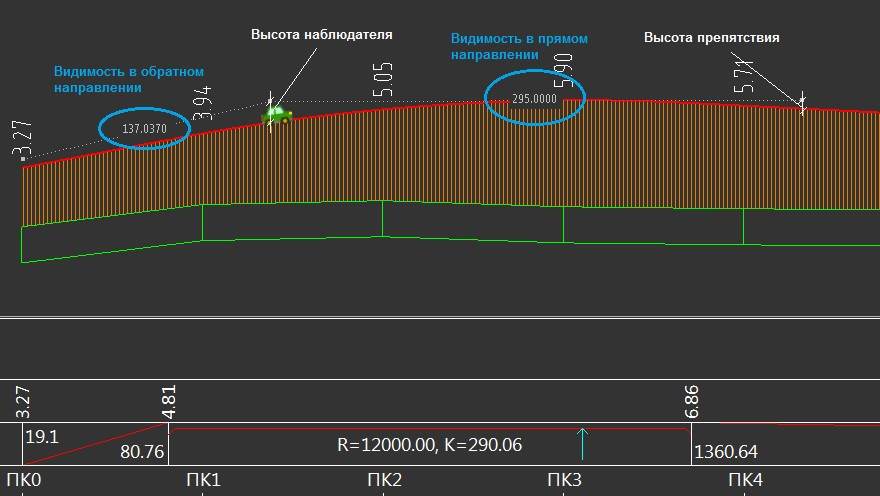
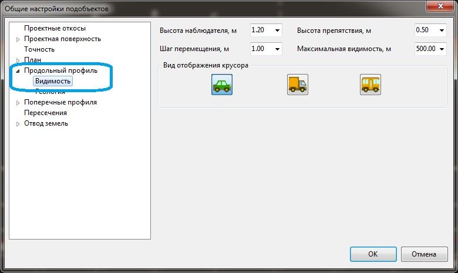

# Видимость на профиле

Функция предназначена для расчета дальности видимости препятствия наблюдателем, двигающимся по запроектированному профилю трассы, т.е. будет рассчитано максимальное расстояние видимости препятствия заданного размера в прямом и обратном направлении.

Для отображения стрел и значений расстояний видимости в прямом и обратном направлении:

1. Выберите меню **Профиль - Видимость на профиле**, курсор примет форму автомобиля, пунктирными линиями будут отображены стрелы видимости в прямом и обратном направлении:

   

   При перемещении курсора по продольному профилю, расстояния видимости в прямом и обратном направлении будут динамически пересчитываться.

2. Для выхода из режима проверки видимости щелкните правой кнопкой мыши или нажмите **Enter**.

## Настройка параметров контроля видимости на профиле

Для изменения параметров контроля видимости в продольном профиле:

1. Нажмите правой кнопкой мыши на текущей модели **Автомобильной дороги**, выберите пункт **Настройки**, в открывшемся окне выберите пункт **Видимость**, раскрыв дерево объектов **Продольный профиль**:

   

   В поле **Высота наблюдателя, м** введите высоту наблюдателя - высоту уровня глаз наблюдателя от уровня проектируемой дороги в метрах;

   В поле **Высота препятствия, м** введите значение минимальной высоты препятствия, для которого необходимо проверить видимость на профиле в метрах;

   В поле **Шаг перемещения препятствия, м** введите значение шага в метрах, с которым будет осуществляться перерасчет видимости препятствия на профиле;

   В поле **Максимальное расстояние видимости, м** введите значение максимального расчетного расстояния видимости препятствия в метрах, при превышении которого расчёт видимости вести проверятся не будет;

   В поле **Вид отображения курсора** выберите изображение которое будет отображаться вместо курсора, в режиме контроля видимости на профиле.

2. Задайте необходимые настройки и нажмите **ОК**.