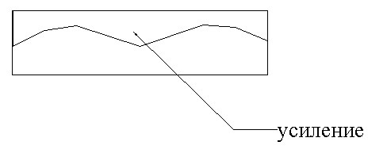
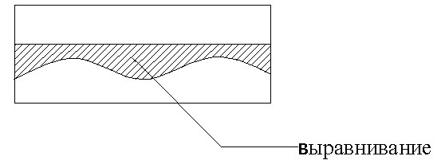
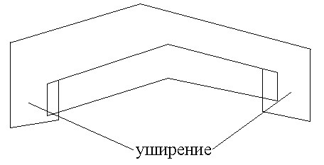
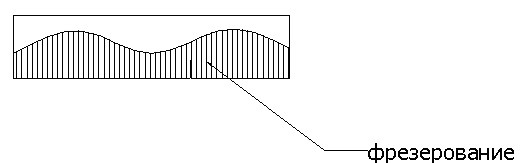
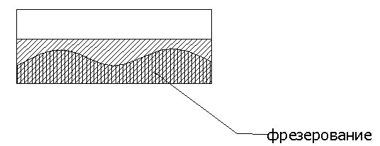
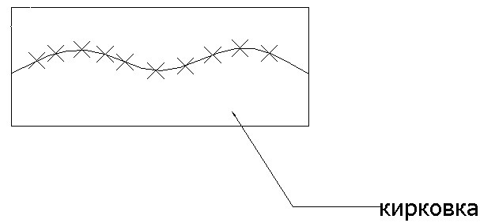

# Разбивка на типы

В процессе проектирования, программа разбивает всю поверхность проектного покрытия на типы. Типы автоматически нумеруются от 1 до 20 в зависимости от рабочей отметки, максимально допустимой глубины фрезерования и проектных слоев дорожной одежды на конкретном поперечнике. В таблице ниже приведены описания используемых типов:

#|
|| № типа | Эскиз | Условие применения ||
|| 1 |  | Усиление/выравнивание одним слоем без фрезерования. ||
|| 2-9 |  | То же 2-9 слоями. ||
|| 10 |  | Уширение. ||
|| 11 |  | Усиление/выравнивание одним слоем с фрезерованием. ||
|| 12-19 |  | То же 2-9 слоями ||
|| 20 |  | Кирковка и полная замена существующего покрытия. ||
|# {wide-content}



 Разбивка поверхности покрытия на типы играет важную роль при конструировании и подсчете объемов. Т.к. уже на этапе проектирования профиля выравнивания, по наличию типов с определенными номерами можно определять нежелательные участки (к примеру: завышенные объемы выравнивающего слоя или превышение допустимой глубины фрезерования) и корректировать их.



Как уже было сказано выше, разбивка на типы происходит на поперечниках автоматически. При изменении рабочих отметок поперечного профиля сразу же происходит обновление границ типов и их номеров.