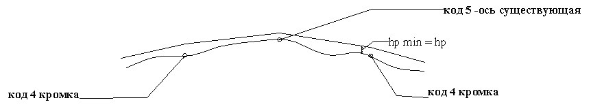
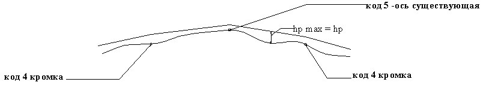
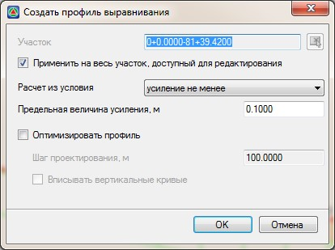
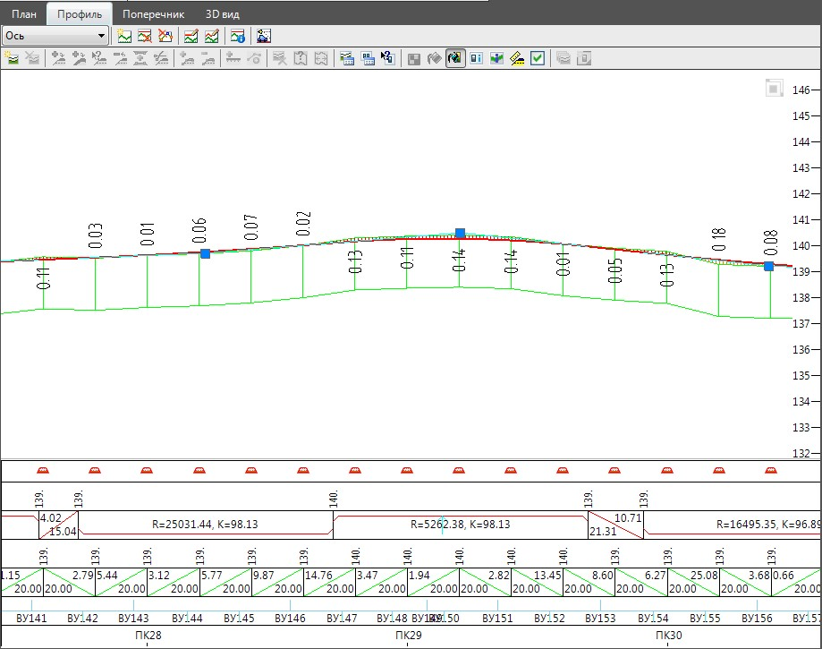
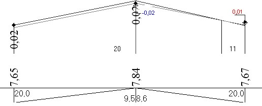

# Построение профиля выравнивания

При автоматизированном создании профиля выравнивания возможны два подхода: усиление не менее (исходя из условия не ослабления существующей конструкции дорожной одежды); усиление не более (исходя из условий минимизации объема выравнивающего слоя).

Проектная отметка продольного профиля (на каждом поперечнике) определяется из соответствующих условий:

* **Усиление не менее** – все рабочие отметки в пределах существующего покрытия на конкретном поперечнике должны быть не **МЕНЕЕ** заданной предельной толщины:

   

* **Усиление не более** – все рабочие отметки в пределах существующего покрытия на конкретном поперечнике, должны быть не **БОЛЕЕ** предельной толщины:

   

Для построения профиля выравнивания выберите элемент меню **Задачи – Выравнивание – Создать профиль выравнивания**. Откроется диалоговое окно:

В графе **Участок** указываются пикеты начала и конца участка для создания профиля выравнивания. **Расчет из условия** – критерий, согласно которому будет осуществляться расчет.

**Предельная толщина усиления** – минимальная (в случае усиление не менее) и максимальная (в случае усиление не более) рабочая отметка на поперечнике в пределах существующего покрытия.

**Оптимизировать профиль** – если данная опция не установлена, то на пикете каждого поперечника будут созданы переломы проектного профиля (то есть, получится ломаный профиль). Если опция установлена, то программа удалит участки профиля с приблизительно равным уклонами и оптимизирует проектный профиль методом наименьших квадратов.

**Шаг проектирования** – минимально-допустимая длина участков проектного профиля. Чем данная величина больше, тем плавнее будет линия проектного профиля, но будут завышаться объемы работ по выравниванию и фрезерованию.

**Вписать вертикальные кривые** – если данная опция установлена, то программа впишет в переломы профиля вертикальные кривые максимально возможных радиусов.

Задайте необходимые параметры автоматического создания профиля выравнивания и нажмите **ОК**.

В результате, программа создаст первое приближение профиля выравнивания и отобразит его в окне **Профиль**:

Автоматически созданный проектный продольный профиль выравнивания может быть откорректирован при помощи функционала, описанного ранее (см. [Продольный профиль](../../road_profile/general_provisions.md)).

В процессе построения профиля выравнивания, автоматически созданный профиль (с вершинами на каждом поперечнике) сохраняется одновременно в двух таблицах: **Проектный профиль** и **Дополнительный профиль**. Дополнительный профиль отображается в окне **Профиль** в виде сплошной желтой линии и служит для визуального контроля отклонений проектного профиля выравнивания от исходного.

При этом отклонение текущего проектного профиля от исходного будет выводиться в окне **Профиль** в скобках над/под рабочими отметками.

На поперечниках также динамически отображаются: минимальная толщина покрытия в виде выноски синего цвета и максимальная толщина покрытия в виде выноски красного цвета:

