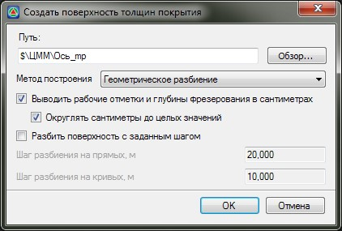
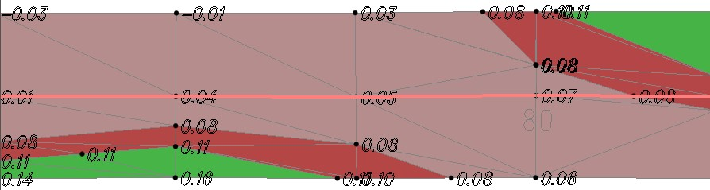
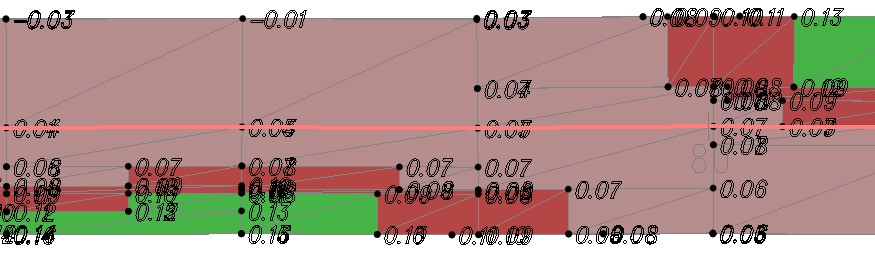
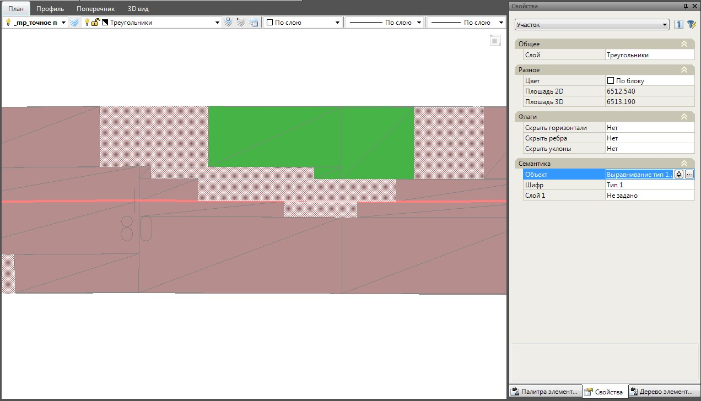
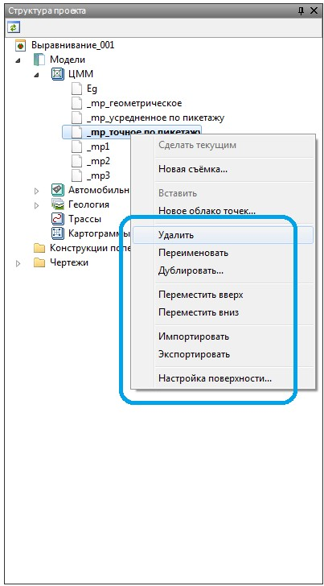
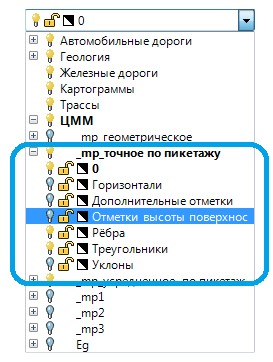

# Создание поверхности толщин покрытия

В результате, может быть построена картограмма работ, представляющая собой поверхность, созданную из рабочих отметок на поперечниках в пределах границ выравнивания.

Для создания поверхности выравнивания выберите элемент меню **Задачи – Выравнивание – Построить поверхность выравнивания**. Откроется следующее диалоговое окно:

В появившемся диалоговом окне укажите путь сохранения и имя создаваемой картограммы.

**Метод построения** - из выпадающего списка выберите один из способов построения картограммы работ:
* **Геометрическое разбиение** - на основе рабочих отметок поперечников формируются точки поверхности, далее методом линейной интерполяции на поверхности определяются промежуточные точки переходов типов и далее строятся контуры границ типов.

  

* **Точное разбиение по пикетажу** - в отличии от геометрического разбиения, контуры границ типов имеют прямоугольную форму, более приближенную к картам фрезерования.

  Механизм построения данного типа поверхности толщин следующий: по границам каждого типа фрезерования\выравнивания в пределах смежных поперечников проводятся линии, далее в каждом образовавшемся прямоугольнике по его средней линии методом линейной интерполяции вычисляется точка перехода типов фрезерования\выравнивания, которая и определяет границу типа всего прямоугольника. В результате контуры поверхности толщин имеют прямоугольные границы.

  

* **Усредненное разбиение по пикетажу** - данный механизм построения поверхности толщин аналогичен **Точному разбиению по пикетажу** с тем отличием что для построения переходных участков будет образовано меньше прямоугольников, а соответственно будет вычисляться меньше точек переходов, что приведет к усредненному построению поверхности выравнивания.

Для вывода значений **Глубины фрезерования** и **Рабочих отметок** в сантиметрах и округленных до целых, установите соответствующие опции.

**Шаг разбиения на прямых и кривых** - при необходимости, для более точного построения картограммы работ, программа может создать дополнительные фиктивные поперечники с заданным шагом и получить на этих участках дополнительные точки с отметками толщин покрытия.

Задайте необходимые параметры построения поверхности толщин покрытия и нажмите **Ок**.

В результате программа создаст картограмму работ и отобразит ее в окне **План**.

Каждый тип отображается на картограмме своим цветом. Для получения информации о свойствах заданного типа, выделите его левой кнопкой мыши. В окне **Свойств** выбранного объекта отобразятся его основные параметры:



 При изменении вертикальной планировки проезжей части картограмму работ необходимо перестроить. Для этого еще раз воспользуйтесь функцией: **Задачи – Выравнивание – Построить поверхность выравнивания**.



Картограмма представляет собой поверхность и сохраняется в структуре проекта в группе моделей с наименованием **ЦММ**. Для ее редактирования, экспорта или удаления:

1. Сделайте данную модель активной, дважды щелкнув по ее наименованию левой кнопкой мыши.
2. Щелкните правой кнопкой мыши по наименованию текущей картограммы и выберите из появившегося контекстного меню требуемое действие:

   

Для настройки видимости элементов картограммы также используйте стандартный **менеджер слоев** текущей модели:
