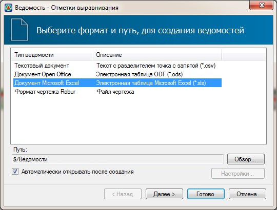
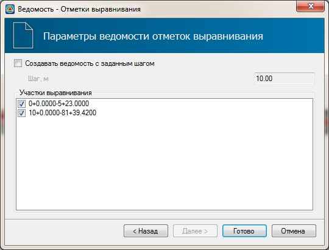
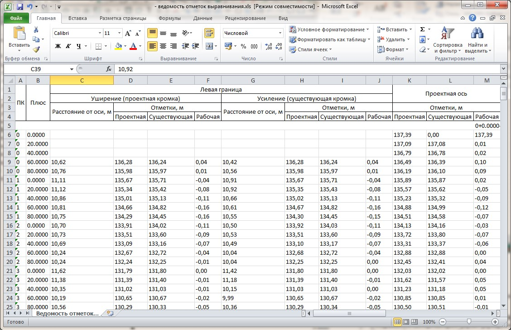

# Создание ведомости отметок

В **Robur** предусмотрена функция создания ведомости отметок, в которую автоматически заносятся все характерные проектные, существующие и рабочие отметки для каждого поперечника.

Для создания ведомости отметок:

1. Выберите элемент меню **Задачи – Выравнивание - Ведомость отметок**.
2. В открывшемся мастере выберите формат формируемой ведомости и нажмите **Далее**:

   

3. На последней вкладке мастера выберите участки, по которым должна быть сформирована разбивочная ведомость. По умолчанию ведомость формируется по поперечникам. Если же требуется создать более детальную ведомость, установите опцию **Создать ведомость с заданным шагом** и задайте его значение:

   

4. Нажмите **Готово**.

В результате программа сформирует ведомость и откроет ее в соответствующем редакторе:

