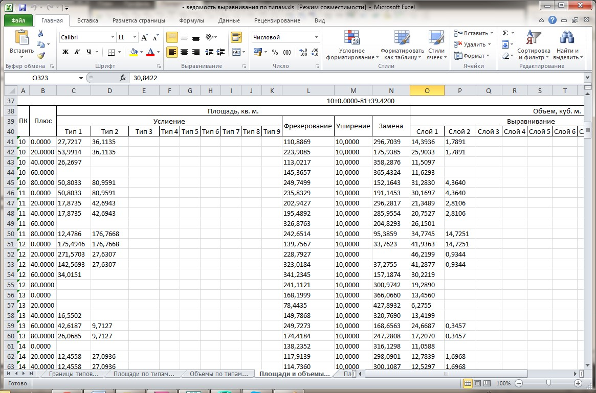

# Создание ведомости объемов

Для создания ведомости объемов работ по ремонту существующего покрытия:

1. Выберите элемент меню **Задачи – Выравнивание - Ведомость типов**, площадей и объемов.
2. В открывшемся мастере выберите формат формируемой ведомости и нажмите **Далее**.
3. На последней вкладке мастера выберите участки, по которым должна быть сформирована ведомость объемов. По умолчанию ведомость формируется по поперечникам. Если же требуется создать более детальную ведомость объемов, установите опцию **Создать ведомость с заданным шагом** и задайте его значение.
4. Нажмите **Готово**.

В результате программа сформирует ведомость и откроет ее в соответствующем редакторе:



 Данная ведомость включает в себя основные объемы работ по ремонту существующего покрытия, такие как: фрезерование, выравнивание, усиление. При наличии реконструируемых участков или полной замены дорожной конструкции, для расчета объемов по данным видам работ (земляные работы, планировочные работы, устройство новой дорожной конструкции и т.п.) необходимо воспользоваться основной стандартной ведомостью (меню: Проект-Создать ведомость - Площадей и объемов).

