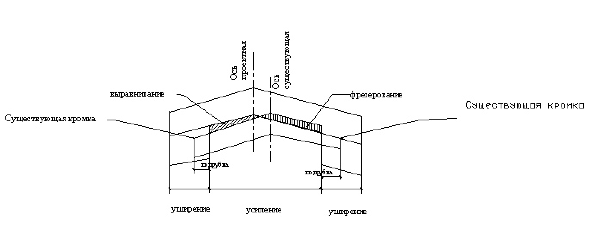

# Общие положения

Данный программный модуль предназначен для автоматизации проектирования ремонта и реконструкции автомобильных дорог. Модуль позволяет запроектировать выравнивание покрытия, рассчитать проектные поперечники в пределах существующей дорожной одежды с учетом проектных ширин, проектных уклонов и значения минимального (максимального) допустимого усиления:

Решение задачи по выравниванию покрытия включает в себя следующие основные этапы:

1. **Подготовка исходных данных**.
2. **Задание параметров выравнивания**.
3. **Проектирования профиля выравнивания**.
4. **Создание картограммы выравнивания и ведомости объемов**.