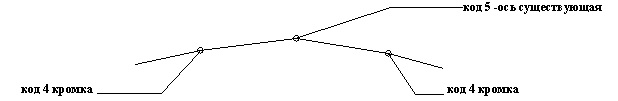

# Подготовка исходных данных

Для работы данного модуля должны быть предварительно созданы:

1. Цифровая модель рельефа (см. [Создания и редактирования элементов поверхности](../../../rb_survey/dtm/sfc/points/notion_dots.md)).

   

   Программа требует обязательное кодирование характерных структурных линий, а именно, 5 – ось существующей дороги. 4 – левая и правая кромки существующей дороги.

   

   При отсутствии цифровой модели рельефа следует использовать данные по черным поперечникам, на которых также должны быть прокодированы вышеуказанные характерные точки (см. [Создание и редактирование черных поперечных профилей](../../../rb_survey/alg/track_crossection/createing_and_editing_black_diameters.md)):

   

2. Проектная ось трассы (см. [План трассы](../../../rb_survey/alg/plan_track/plan_track.md)).
3. Черный продольный профиль, сформированный по цифровой модели рельефа или по данным черных поперечников (см. [Продольный профиль](../../../rb_survey/alg/track_profile/create_black_profile.md)).
4. Сформированный верх проектной конструкции с заданными ширинами и уклонами основных полос (см. [Проектирование поперечных профилей](../../road_crossection/total/general_information.md)).



 При ремонте покрытия, на участках где не предусмотрено уширение конструктивных слоев дорожной одежды в большинстве случаев используется стандартный шаблон – Выравнивание покрытия. При наличии участков уширений, с одной или обеих сторон проезжей части, рекомендуется пользоваться стандартными шаблонами для дорог 2-5 категории или 1-ой категории с разделительной полосой. Также, возможно использование индивидуальных шаблонов проектной конструкции. Процедура их создания и применения была описана ранее (см. [Создание и редактирование конструкций](../../road_crossection/creating_and_editing_constructions.md)).

