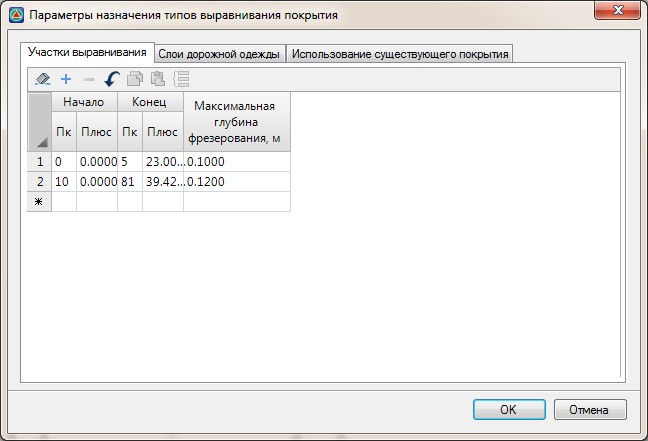
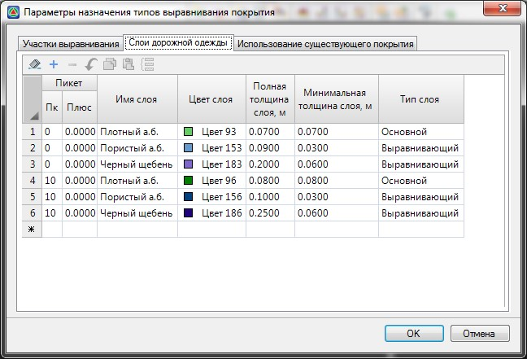
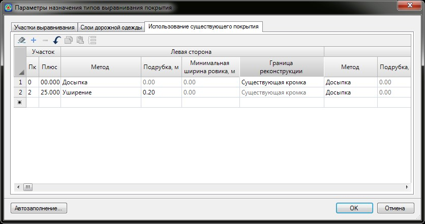
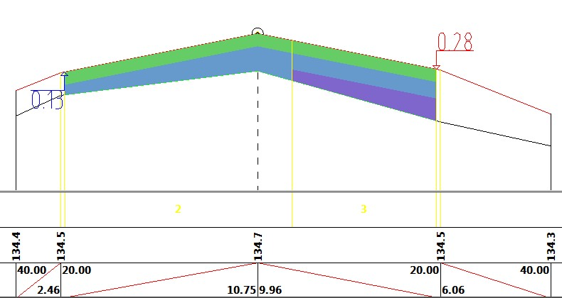

# Задание параметров выравнивания

После того как все вышеперечисленные данные в **ЦММ** и модели проектируемой дороги были назначены, приступим к заданию параметров фрезерования и выравнивания:

Для задания параметров выравнивания и фрезерования выберите элемент меню **Задачи – Выравнивание – Параметры назначения типов**. Откроется диалоговое окно:

На вкладке **Участки выравнивания** задаются пикеты начала и конца участков, на которых будет производиться выравнивание покрытия. Эти участки не обязательно должны находиться рядом друг с другом и граница одного участка не обязательно должна примыкать к границе другого участка. Допускается создавать участки не связанные друг с другом.

Для каждого характерного участка задается максимально допустимая глубина фрезерования – величина, на которую можно заглубиться в существующую конструкцию. Если заглубление окажется более максимальной глубины фрезерования, заданной в таблице, то в этом случае будет производиться кирковка и полная замена существующей конструкции дорожной одежды. По сути, это некоторая контрольная величина, с которой будет сопоставляться фактическая глубина фрезерования, рассчитываемая программой.



 На данной вкладке должен быть задан хотя бы один участок, например от начала и до конца трассы, даже если фактическое фрезерование на нем не предусматривается.



На вкладке **Слои дорожной одежды** задается ее конструкция, причем последовательность задания слоев соответствует их расположению (сверху вниз):



1. Можно задать различную конструкцию дорожной одежды на разных участках.
2. Значения в графах **ПК Плюс** должны соответствовать началу участков, заданных на вкладке Участки выравнивания.
3. Всего может быть задано до 9 слоев в конструкции дорожной одежды.



Возможны три типа слоев, из которых формируется набор, устраиваемой конструкции дорожной одежды: основной, выравнивающий и выравнивающий с фрезерованием.



 Основные слои (минимум один) всегда должны присутствовать в конструкции, а выравнивающие – при необходимости. В противном случае будет выдано предупреждение:
 
 



В графе **Полная толщина слоя** задается полная проектная толщина слоя.

В графе **Минимальная толщина** – минимально допустимая конструктивная толщина, которая задается для выравнивающего слоя и выравнивающего с фрезерованием.

## Особенности работы различных типов устраиваемых слоев:

* Если при проектировании, устройство **основного слоя** полной толщины невозможно, то производится предварительное фрезерование.

  

  Верхний (первый) слой всегда должен быть основным.

  

* Если, при проектировании, фактическая толщина **выравнивающего слоя с фрезерованием** оказывается менее его минимально допустимой толщины, то на данном участке производится предварительное фрезерование.

  

  Фрезерование производится только для устройства выравнивающего слоя минимальной величины, либо слой исключается, например, в случае наличия фрезерования под вышележащий основной слой.

  

* Если, при проектировании, фактическая толщина **выравнивающего слоя** оказывается менее его минимально допустимой толщины, то этот слой **ИСКЛЮЧАЕТСЯ** из конструкции, а выравнивание производится за счет увеличения толщины вышележащего слоя (основного или выравнивающего).

  

  Фрезерование под данный слой не производится. Выравнивающий слой либо исключается, либо где это возможно, устраивается от минимальной до полной толщины.

  

* Толщина последнего выравнивающего слоя определяется по расстоянию до линии существующей земли и может превышать значение, заданное в поле **Полная толщина слоя**. Если фактическая толщина выравнивающего слоя превышает допустимое значение, задайте дополнительный выравнивающий слой или отредактируйте вертикальную планировку проезжей части на данном участке.

Вкладка **Использование существующего покрытия** содержит таблицу, в которой для каждого характерного участка задается\не задается метод использования существующей дорожной одежды:

Более подробно схема использования существующего покрытия при уширении дорожной одежды была описана ранее в разделе [Реконструкция](../../road_crossection/total/reconstruction.md). При отсутствии уширений с обеих сторон ремонтируемой проезжей части, данная таблица не заполняется.

Задайте все необходимые данные на вкладках окна **Параметры назначения типов** выравнивания покрытия и нажмите **ОК**.

В результате, программа разобьет всю поверхность проектного покрытия на типы и отобразит их на поперечниках. 

Далее рассмотрим основные принципы разбивки конструкции на типы.