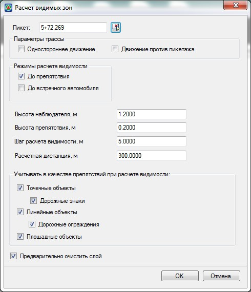

# Анализ не видимых зон

После построения подробной картограммы видимости будут определены ячейки (зоны), в которых расчетная видимость не обеспечивается. Далее необходимо проанализировать причину нарушения видимости определив ячейки, в которых не обеспечена видимость с исходного участка. Для этого:

1. Выберите меню **Задачи – Видимость в 3D – Видимые зоны**, откроется диалоговое окно:

   

   В поле **Пикет** указывается участок, с которого будет оценена видимость и построена картограмма видимых зон.

   **Расчетная дистанция** – параметр, определяющий, на какое расстояние от указанного пикета будет построена картограмма видимых зон.

   

   Все остальные настройки подробно описывались [выше](construction_cartograms_visibility_bands.md).

   

2. Задайте необходимые параметры и нажмите **ОК**. В результате будет построена картограмма видимых зон, на заданное расстояние от исходной точки:

   

   Засечкой показывается положение (пикет) с которого производится оценка видимости.

   Ячейки картограммы, раскрашенные **зеленым цветом**, свидетельствуют о том, что данные участки трассы просматриваются и видимы с указанного положения трассы (пикета).

   Ячейки картограммы, раскрашенные **красным цветом**, свидетельствуют о том, что данные участки трассы не просматриваются и не видимы с указанного положения трассы (пикета).