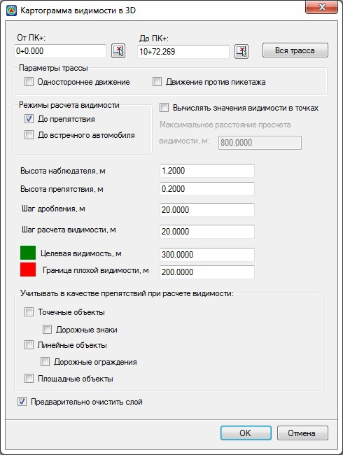
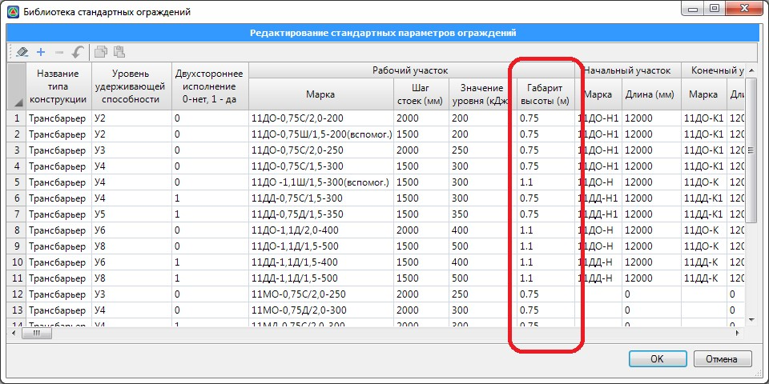

# Построение картограммы видимости по полосам

Для построения картограммы по полосам:

1. Выберите меню **Задачи – Видимость в 3D – Картограмма по полосам**, откроется диалоговое окно:

   

   **От ПК+ до ПК+** - в данных полях ввода вручную или визуально, с помощью соответствующих кнопок указывается пикетажный участок трассы, на котором будет осуществляться оценка видимости и построение картограммы. Нажмите кнопку Вся трасса чтобы автоматически выбрать участок охватывающий всю трассу.

   В поле **Параметры трассы** указывается тип и направление движения транспортных средств. В зависимости от установленных параметров движения будет соответствующим образом производиться оценка видимости на данной автомобильной дороге.

   В поле **Режимы расчета** видимости имеется возможность выбрать критерий, который будет использоваться при расчете оценки видимости.

   При выборе режима расчета видимости - **До препятствия**, оценка видимости будет производиться только до препятствия заданного размера (высоты), т.е. препятствие будет переставляться по полосе движения с заданным шагом. В каждой точке расположения препятствия будет проверяться расстояние видимости.

   При выборе режима расчета видимости - **До встречного автомобиля**, будет осуществляться оценка видимости встречной полосы движения.

   

   В случае многополосной дороги оценка видимости будет рассчитываться только для первой полосы движения (от оси дороги) и до ближайшей встречной полосы движения.

   

   При включении опции **Вычислять значения видимости в точках** имеется возможность в каждой ячейке картограммы подписать максимальное значение видимости, указав в соответствующем поле ввода максимальное расстояние, до которого необходимо проверять видимость.

   * **Высота наблюдателя, м** - в данном поле задается значение высоты уровня глаз наблюдателя (водителя) от уровня проезжей части дороги в метрах;
   * **В поле Высота препятствия, м** - в данном поле задается значение минимальной высоты препятствия, для которого необходимо проверить видимость в метрах;
   * **Шаг дробления** – величина, которая определяет с каким шагом ячеек будет разбита и построена картограмма;
   * **Шаг расчета видимости** – величина, которая определяет с какой точностью будет рассчитана картограмма видимости в каждой ячейке.

     

     

     Чем меньше значение Шага дробления и Шага расчета видимости, тем с большей точностью будет оценена 3D видимость на выбранном участке автомобильной дороги. Значение Шага расчета видимости должно быть либо равно, либо меньше Шага дробления.

     

   В поле ввода **Целевая видимость** задается минимальное значение расстояния видимости, при котором ячейка картограммы закрашивается зеленым цветом и считается, что с данного участка трассы расстояние видимости обеспечено.

   В поле ввода **Граница плохой видимости** задается максимальное значение расстояния видимости, при котором ячейка картограммы закрашивается красным цветом и считается, что с данного участка трассы расстояние видимости не обеспечено.

   

   Если значение рассчитанной видимости попадает в интервал между Целевой видимостью и Границей плохой видимости, то ячейка картограммы закрашивается желтым цветом и считается, что с данного участка трассы расстояние видимости находится на пограничном участке.

   

   В поле Учитывать в качестве препятствий при расчете видимости, выбираются те объекты, которые оказывают влияние и каким либо образом ограничивают видимость при расчете.

   * **Точечные объекты** - к данным объектам относятся точки поверхности, для которых назначен объект семантики (т.е. условные знаки), например, такие как: 1010 Опора, 1025 Светофор, 1041 Дерево отдельно стоящее и т.д. В расчете видимости учитываются те точечные объекты, у которых заданы параметры Ширина и Высота. Значения данных параметров задается по умолчанию в Менеджере структуры семантики.
   * **Дорожные знаки** - объекты типа Дорожные знаки. Стойки и щиты дорожных знаков учитываются в расчете по своим геометрическим размерам.
   * **Линейные объекты** - к данным объектам относятся структурные линии, для которых назначен объект семантики (т.е. условные знаки), например, такие как 1040 Полоса древесных насаждений, 1044 Ограда и т.д. Для учета линейных объектов в расчете видимости, у объектов данного типа имеется параметр **Высота**, значение которого задано по умолчанию в **Менеджере структуры семантики**.
   * **Дорожные ограждения** - объекты типа Дорожные ограждения.

     

     Объекты типа сигнальные столбики при оценке видимости не учитываются.

     

     Дорожные ограждения учитываются аналогично линейным объектам, т.е. имеется параметр **Высота** (Габарит высоты), который задан для ограждений в Библиотеке дорожных ограждений:

     

     

     Для упрощения расчета 3D видимости, дорожное ограждение воспринимается как объект, который полностью ограничивает видимость от земли и до габарита высоты ограждения. Т.е. считается, что просвет между секцией балки и землей отсутствует.

     

   * **Площадные объекты** - к данным объектам относятся замкнутые структурные линии (полигоны), для которых назначен объект семантики (т.е. условные знаки), например, такие как 1063 Лес, 1045 Забор деревянный, 1076 Кустарник и т.д. Для учета площадных объектов в расчете видимости, у объектов данного типа имеется параметр **Высота**, значение которого задано по умолчанию в **Менеджере структуры семантики**.

     

     1. При оценке 3d видимости учитываются те объекты, которые находятся на видимых слоях.
     2. В пределах проектных поверхностей при оценке видимости не учитываются Площадные объекты (например, Лес), так как считается, что при строительстве дороги объекты данного типа будут «демонтированы»

     

   Опция **Предварительно очищать слой** позволяет автоматически удалить ранее созданную картограмму видимости.

2. Задайте все необходимые параметры и нажмите **Ок**. В результате будет построена картограмма видимости:

   

   Ячейки картограммы, раскрашенные *красным цветом*, свидетельствуют о том, что максимальное значение видимости с данных ячеек меньше или равно заданному значению в поле **Граница плохой видимости**, т.е. видимость с данных ячеек не обеспечена.

   Ячейки картограммы, раскрашенные *зеленым цветом*, свидетельствуют о том, что максимальное значение видимости с данных ячеек больше или равно заданному значению в поле **Целевая видимость**, т.е. видимость с данных ячеек обеспечена.

   Ячейки картограммы, раскрашенные *желтым цветом*, свидетельствуют о том, что максимальное значение видимости с данных ячеек находится между **Целевой видимостью** и **Границей плохой видимости**.

   Цифры в начале каждой ячейки соответствуют максимальному значению видимости с данного участка трассы.

   

   Все элементы картограммы располагаются на слое Картограмма 3d видимости.

   