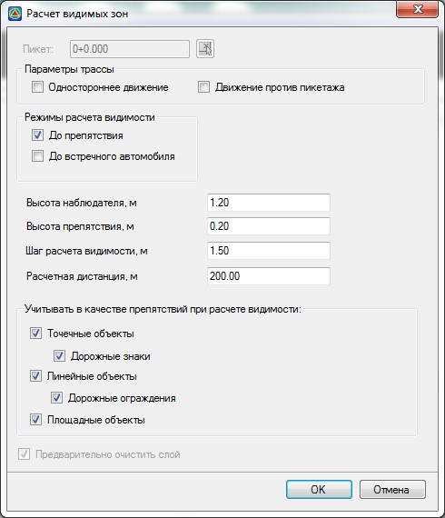

# Лучи видимости и преграды

Для анализа причины нарушения видимости можно отрисовать лучи визирования от наблюдателя до расчетного препятствия. Для этого:

1. Выберите меню **Задачи – Видимость в 3D – Лучи видимости и преграды**, откроется диалоговое окно:

   

   Подробно все параметры описывались [выше](construction_cartograms_visibility_bands.md).

   При необходимости скорректируйте параметры и нажмите **ОК**.

2. Курсор примет форму прицела, укажите положение (участок трассы проезжей части) с которого необходимо построить лучи видимости. В результате будут построены лучи видимости:

   

   В случае, если луч видимости не пересекает какое либо препятствие, то он раскрашивается **зеленым цветом**.

   В случае, если луч видимости пересекает какое либо препятствие, то в месте пересечения ставится значок - крестик и луч раскрашивается **красным цветом**.

   **При наведении на значок** - крестик, в динамической строке подписывается название объекта, который пересек луч видимости. В данном случае причиной нарушения видимости стал контур структурной линии, для которого задана семантика – Лес.

