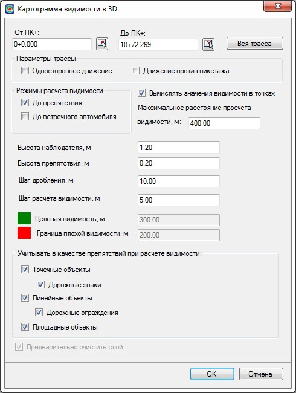
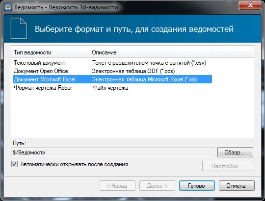

# Ведомость расстояний видимости по полосам

1. Выберите меню **Задачи – Видимость в 3D – Ведомость расстояний видимости по полосам**, откроется диалоговое окно:

   

2. При необходимости скорректируйте параметры и нажмите **Ок**.
3. Откроется стандартный мастер формирования ведомостей:

   

   Выберите тип редактора, в котором необходимо открыть созданную ведомость и нажмите **Готово**.

В результате будет сформирована ведомость расстояний видимости по полосам:

