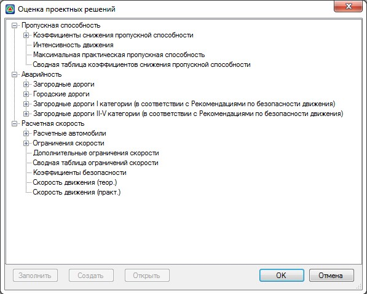
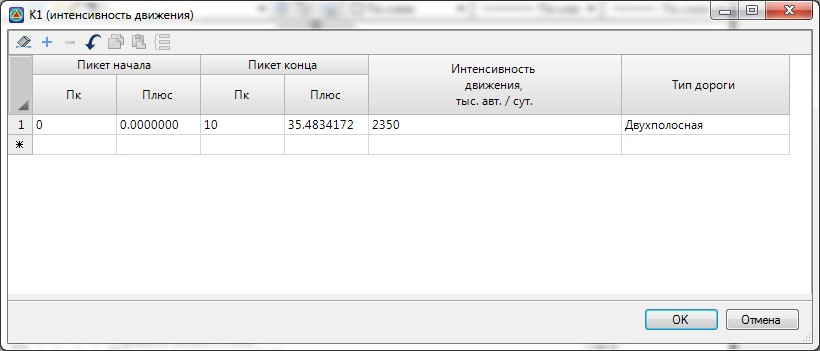
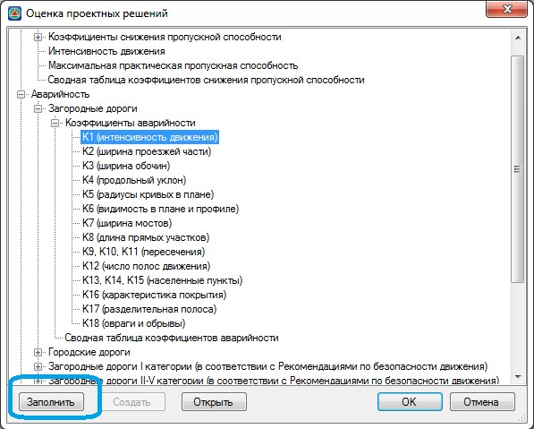
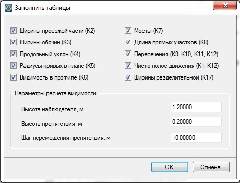
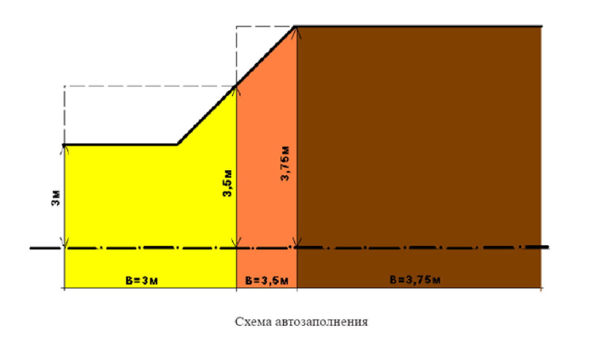
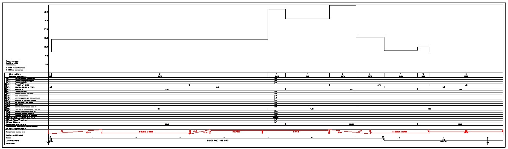

# Оценка уровня аварийности

Оценка уровня аварийности для типа **Загородных дорог** производится по ВСН 25-86 (УКАЗАНИЯ ПО ОБЕСПЕЧЕНИЮ БЕЗОПАСНОСТИ ДВИЖЕНИЯ НА АВТОМОБИЛЬНЫХ ДОРОГАХ).

А также, для **Городских** и **Загородных дорог** по отраслевому документу (РЕКОМЕНДАЦИИ ПО ОБЕСПЕЧЕНИЮ БЕЗОПАСНОСТИ ДВИЖЕНИЯ НА АВТОМОБИЛЬНЫХ ДОРОГАХ).

Для оценки состояния объекта или проектного решения по методу коэффициентов аварийности воспользуйтесь элементом меню **Задачи- Оценка проектных решений**. Появится следующее диалоговое окно:

Для заполнения таблиц частных коэффициентов раскройте дерево, и дважды щелкните левой кнопкой мыши по наименованию таблицы, которую требуется заполнить. Итоговый коэффициент аварийности представляет собой произведение частных коэффициентов, каждый из которых задается в своей таблице. Ниже представлен пример попикетного задания частного коэффициента **K1**, значения которого зависят от интенсивности движения и типа дороги:

Некоторые таблицы могут заполняться автоматически, на основании данных проекта (к примеру: элементов плана или профиля). Для того чтобы автоматически заполнить соответствующие таблицы выполните следующие действия:

1. Выделите одну из таблиц частных коэффициентов аварийности и нажмите кнопку **Заполнить**, расположенную в нижней части окна:

   

2. Откроется следующее диалоговое окно:

   

3. Отметьте необходимые коэффициенты, которые будут заполняться на основании данных проекта и нажмите **ОК**.

   

   Для заполнения таблицы частного коэффициента К6 дополнительно необходимо задать в соответствующих полях параметры используемые для определения расстояния видимости в продольном профиле. Особенности автозаполнения таблиц частных коэффициентов:

   1. **Ширины проезжей части** – в качестве ширины берется сумма полос проезжей части (без краевой полосы) с учетом уширения на виражах. Краевая полоса включается в ширину обочины и разделительной полосы. Если ширина проезжей части переменная, то в таблицу могут быть заполнены пикеты границ характерных участков. Пикет границы участка определяется там, где изменяется значение частного коэффициента:

      

   2. **Ширины обочин** – при различных ширинах обочин справа и слева, берется минимальная ширина обочины. Пикет границы участка определяется там, где изменяется значение частного коэффициента.
   3. **Ширины разделительной** - берется общая ширина разделительной полосы. Пикет границы участка определяется там, где изменяется значение частного коэффициента.
   4. **Продольный уклон** – пикеты границ участков и расчетные значения заполняются по данным проектного продольного профиля.
   5. **Радиусы кривых в плане** – пикеты границ участков и расчетные значения заполняются по данным плана трассы.
   6. **Видимость в профиле** – пикеты границ участков и расчетные значения заполняются по данным проектного продольного профиля. Расчет производится только в прямом направлении.
   7. **Длина прямых участков** – пикеты границ участков и расчетные значения заполняются по данным плана трассы.
   8. **Пересечения** – если для текущего подобъекта было запроектировано одно или несколько пересечений, то пикеты их границ автоматически занесутся в таблицу.
   9. **Число полос движения** – берется число основных полос в обоих направлениях.
   10. **Мосты** - если в структуре проекта для текущей трассы были заданы участки мостов, то пикеты их границ будут занесены в соответствующую таблицу.



Все таблицы данного модуля, аналогично таблицам структуры проекта, поддерживают возможность экспорта и импорта данных. Для этого необходимо выполнить следующие действия:

1. Щелкните правой кнопкой мыши, по наименованию таблицы, данные которой необходимо импортировать или экспортировать. Появится следующее контекстное меню:

   

2. Выберите из меню необходимую команду.

   

   Импорт данных возможен только в случае, если формат таблицы соответствует структуре загружаемых данных.

   

На основании данных таблиц частных коэффициентов, программа автоматически формирует сводную (итоговую) таблицу коэффициентов аварийности. При этом, каждый раз при открытии этой таблицы программа будет выдавать следующие сообщение:

* Выберите **ОК**, если данные исходных таблиц редактировались и сводную таблицу необходимо пересчитать.
* Выберите **Отмена**, если предварительно введенные данные сводной таблицы должны быть сохранены.
* Опция **Учитывать зоны** влияния позволяет выполнять пересчет сводной таблицы с учетом зон влияния некоторых коэффициентов приведенных в РЕКОМЕНДАЦИЯХ ПО ОБЕСПЕЧЕНИЮ БЕЗОПАСНОСТИ ДВИЖЕНИЯ НА АВТОМОБИЛЬНЫХ ДОРОГАХ.

Данные хранящиеся в этой таблице, также доступны для редактирования.



При формировании сводной таблицы, значения частных коэффициентов для не заполненных таблиц по умолчанию принимаются равным 1.



На основании значений итоговых и частных коэффициентов может формироваться график аварийности:

Процедура формирования чертежей будет описана [далее в соответствующем разделе](formation_graphics_accidents.md).

Процедура расчета аварийности для городских улиц, а также загородных дорог (в соответствии с рекомендациями по безопасности) аналогична и отличается лишь набором таблиц частных коэффициентов.