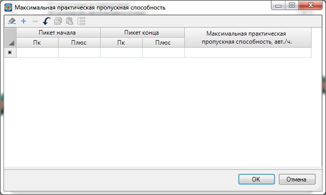
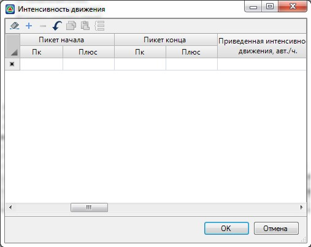
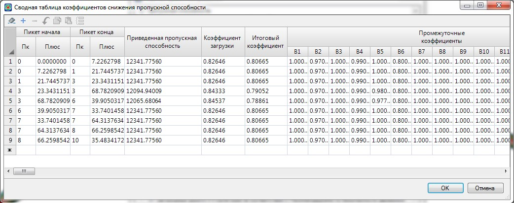
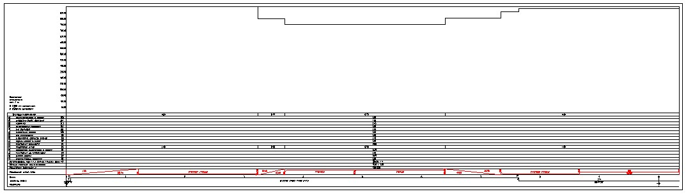

# Оценка уровня загрузки

В соответствии с «Руководством по оценке пропускной способности автомобильных дорог» (от 1982г.), под уровнем загрузки дороги понимается отношение интенсивности движения, зафиксированной на рассматриваемом участке, к практической пропускной способности этого участка. Практическая пропускная способность представляет собой произведение максимальной практической пропускной способности и итогового коэффициента учитывающего ее изменение.

Для задания максимальной практической пропускной способности необходимо выполнить следующие действия:

1. Раскройте дерево структуры как указано ниже, и щелкните дважды левой кнопкой по наименованию соответствующей таблицы.

2. Заполните открывшуюся таблицу данными по максимально возможной пропускной способности и нажмите **ОК**

   

Аналогичным образом откройте и заполните таблицу **Интенсивность движения**:

Итоговый коэффициент изменения пропускной способности представляет собой произведение пятнадцати частных коэффициентов учитывающих влияние различных элементов дороги. Для его вычисления раскройте дерево структуры как указано ниже, и заполните соответствующие таблицы:



1. Некоторые таблицы частных коэффициентов изменения пропускной способности, аналогично таблицам частных коэффициентов аварийности, могут быть заполнены автоматически. Процедура автозаполнения была описана ранее в разделе Оценка аварийности.
2. Также поддерживается возможность импорта/экспорта таблиц из/в другие табличные редакторы, например MSExcel. Последовательность действий для выполнения импорта или экспорта данных была описана ранее в разделе [Оценка уровня аварийности](assessment_level_accidents.md).



На основании данных таблиц частных коэффициентов, автоматически формируется сводная таблица коэффициентов снижения пропускной способности. При этом, каждый раз при открытии этой таблицы программа будет выдавать следующие сообщение:

* Выберите **Да**, если данные исходных таблиц редактировались и сводную таблицу необходимо пересчитать.
* Выберите **Нет**, если предварительно введенные данные сводной таблицы должны быть сохранены.

  

На основании значений итоговых и частных коэффициентов может формироваться график снижения пропускной способности:

Процедура формирования чертежей будет описана [далее](formation_graphics_accidents.md) в соответствующем разделе.