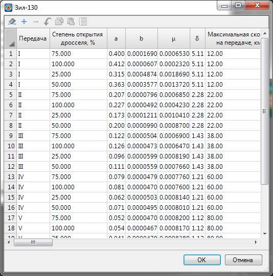
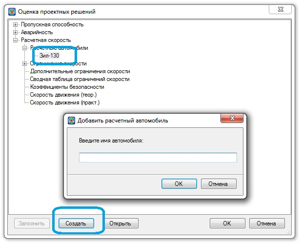
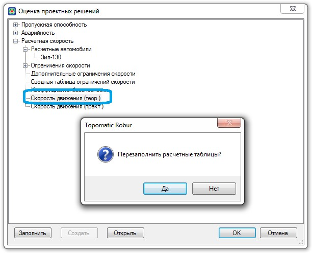
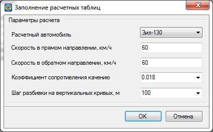
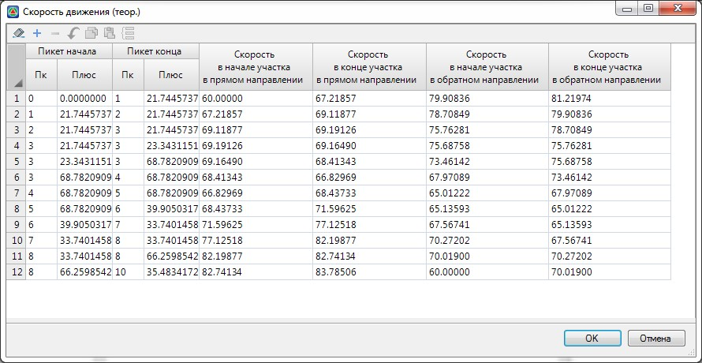
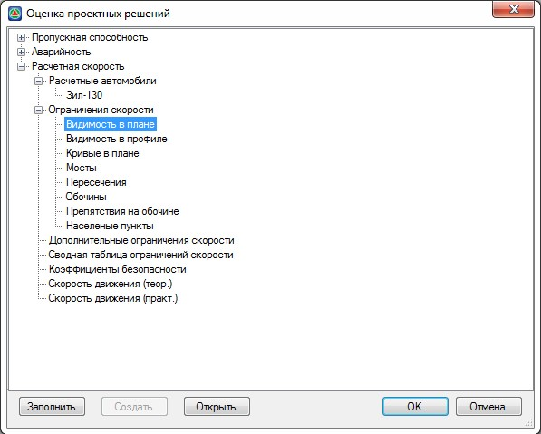
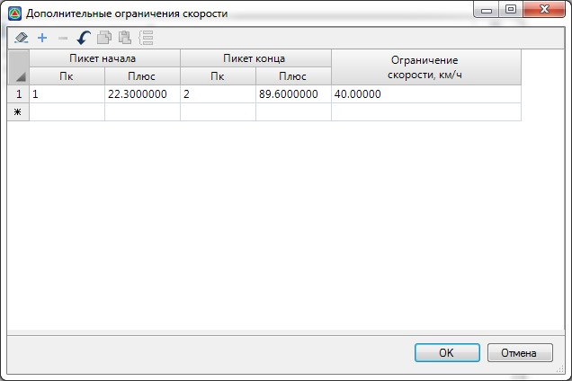

# Определение расчетной скорости и уровня безопасности движения

Теоретическая скорость движения заданного типа автомобиля в любой точке продольного профиля определяют в зависимости от используемой передачи и степени открытия дроссельной заслонки. Для определения скорости движения используется следующая расчетная формула:

Где:
* Vh - Скорость движения в начальной точке, км/ч; e - основание натурального логарифма =2,71828.
* S - расстояния от начала участка до точки в которой определяется скорость, м.
* K0, К2 и μ- параметры определяемые по следующим формулам:

  

  Где:

* f - коэффициент сопротивления качению.
* i - продольный уклон участка в начальной точке при S=0. При подъеме значение уклона принимается положительным, а при спуске отрицательным.
* Rb - радиус вертикальной кривой , δ- коэффициент учитывающий инерцию вращающихся масс.
* g – ускорение свободного падения.



Параметры Vh и f, задаются непосредственно перед расчетом скорости, в соответствующем диалоговом окне.a, b, μ, δ - коэффициенты соответствующие расчетному автомобилю и зависящие от передачи, степени открытия дросселя и соответствующего диапазона скоростей.



Ниже представлена таблица с параметрами расчетного автомобиля ЗИЛ-130:

База расчетных автомобилей может дополняться пользователем.

Для того чтобы ввести новый расчетный автомобиль:

1. Откройте дерево структуры как показано ниже и нажмите кнопку **Создать**, появится следующие диалоговое окно:

   

   После этого он должен появиться в группе **Расчетные автомобили**. Для определения расчетной скорости вновь введенного автомобиля, необходимо задать его параметры. Для этого, выберите аналогичным образом требуемый автомобиль из списка, щелкнув по нему левой кнопкой мыши и заполните соответствующую таблицу. За основу могут быть приняты параметры другого расчетного автомобиля.

   

   Также поддерживается возможность импорта/экспорта данных таблиц из/в другие табличные редакторы, например Excel.

   

   Для определения теоретической скорости движения расчетного автомобиля щелкните дважды левой кнопкой мыши по соответствующему пункту. Появится следующее окно:

   

2. В данном окне выполните одно из следующих действий:

   * Нажмите **Да** если необходимо перед открытием таблицы теоретической скорости пересчитать ее заново.
   * Нажмите **Нет** если необходимо открыть эту таблицу без пересчета.

3. Если был выбран вариант **Да**, то появится дополнительное диалоговое окно:

   

Задайте необходимые параметры вычисления теоретической скорости движения расчетного автомобиля и нажмите **ОК**. В результате, будет открыта таблица с результатами расчета. При необходимости данные в ней могут быть откорректированы:

Эти данные будут использованы для построения графика скорости движения расчетного автомобиля. На основании расчетных характеристик автомобиля и данных продольного профиля программа строит график расчетной скорости движения. Однако, реальные условия движения по дороге могут ограничиваться также элементами плана, дорожными знаками, т.е. отличатся от максимально допустимых, рассчитанных по динамическим характеристикам. Соответственно, в расчет скорости вводится поправочный коэффициент, учитывающий влияние дорожных условий и средств организации движения. Для его вычисления необходимо заполнить таблицы входящие в группу **Ограничения скорости**:



Некоторые из вышеуказанных таблиц, аналогично таблицам частных коэффициентов аварийности и снижения пропускной способности, могут быть заполнены автоматически.



В таблице **Дополнительные ограничения скорости** могут задаваться дополнительные частные участки, которые не входят в общую группу ограничений:

Общий принцип расчета практической скорости и коэффициентов безопасности следующий:

Участки из таблицы теоретической скорости дополняются участками из сводной таблицы ограничений. И на концах получившихся участков рассчитываются путём линейной интерполяции по теоретической скорости значения начальной и конечной скоростей – Vн и Vк (для прямого и обратного направлений движения). Далее, для тех участков из них, для которых существует ограничение в сводной таблице ограничений, - оно по необходимости применяется т.е. значение практической скорости выставляется равным этому ограничивающему значению скорости Vог, если ограничение не соблюдено хотя бы на одном из концов участка: (Vогр<Vн или Vогр < Vк), а в противном случае за значение практической скорости берётся среднее значение скорости на участке.

Коэффициенты безопасности вычисляются на том этапе, когда для таблицы практической скорости уже рассчитаны интерполированные значения скоростей на концах участков. Коэффициент безопасности равен отношению допускаемой скорости к входной (Vдоп/Vвх).

В качестве входной скорости выступает значение в начале участка Vн, в качестве допускаемой скорости - значение ограничения Vогр, когда оно есть, Либо скорость в конце участка Vк, когда ограничения нет.