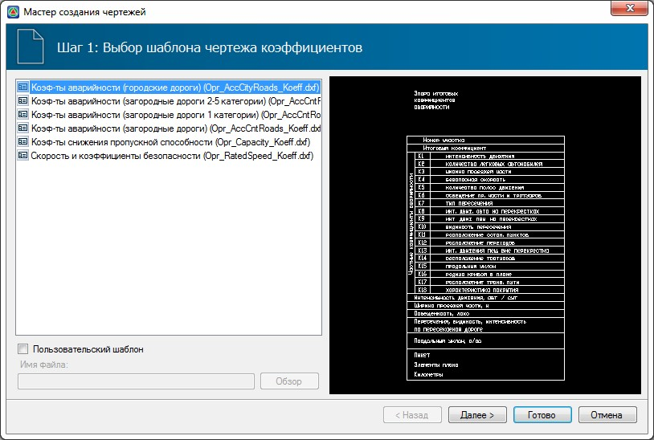
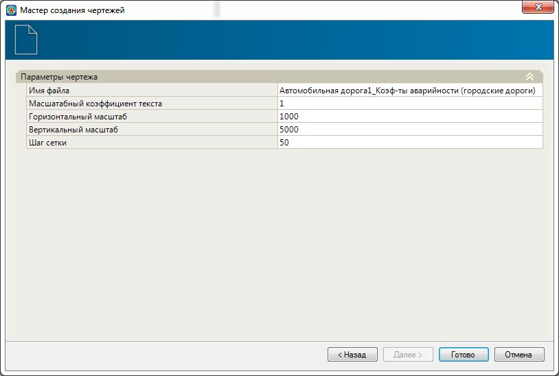

# Формирование графиков аварийности, пропускной способности и скоростей движения

Чертежи формируются по данным содержащимся в соответствующих итоговых таблицах, которые должны быть заполнены до их создания.

Для создания чертежа выполните следующие действия:

1. Выберите элемент меню **Задачи - Оценка проектных решений - Создать чертеж**. Откроется стандартный мастер формирования чертежей:

   

2. Выберите из списка шаблон, на основе которого необходимо сформировать чертеж и нажмите **Далее**.

   

   При необходимости использования собственного (отредактированного) шаблона чертежа, установите опцию Пользовательский шаблон и нажав кнопку Обзор выберите соответствующий файл шаблона. Принципы создания/редактирования шаблонов чертежей будут описаны [далее](../../../doc/edit_dynamic_drawing/general_information.md) в отдельном приложении.

   

3. На последнем шаге мастера задайте общие параметры создаваемого чертежа и нажмите **Готово**.

   

В результате, программа сформирует чертеж по заданному шаблону и откроет его в отдельном окне.