# Оценка траектории движения

В программном комплексе **Топоматик Robur** реализована специализированная функция для оценки траектории движения. 

Ее возможности можно использовать как для проверки проектных решений (на примыканиях и кольцевых пересечениях, на площадках и т.д.), так и для анализа существующей ситуации (ситуационных планов, растровых подложек). 

В данном разделе рассматриваются варианты ввода траектории, настройки оформления траектории, а также описывается редактор моделей машин. 

## Ввод траектории движения

В программе реализовано два способа ввода: вручную и с выбором линейного объекта.

<u>**Для ввода траектории вручную:**</u>

1. Выберите меню **Задачи** – **Оценка траектории движения** – **Траектория движения**.

2. Укажите ЛКМ вершины траектории и нажмите **Enter**.

   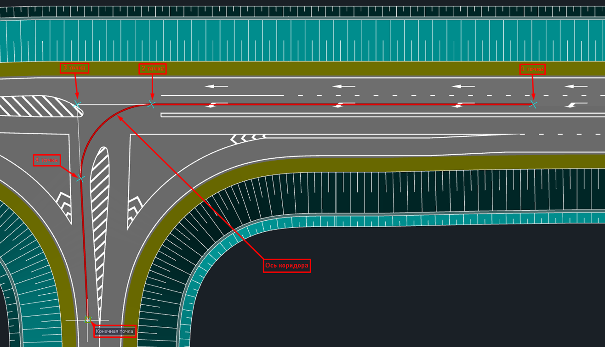

3. Как результат программа произведет расчет коридора.

   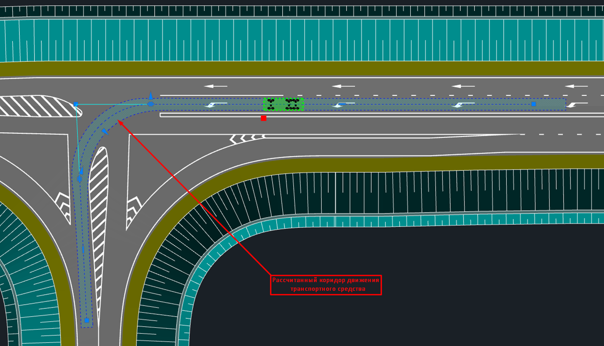

<u>**Для ввода траектории по выбору объекта:**</u>

1. Выберите меню **Задачи** – **Оценка траектории движения** – **Траектория движения**.
2. Нажмите ПКМ – **Выбор объекта** и укажите линейный объект (полилинию, структурную линию, трассу и т.п.).
3. Как результат программа произведет расчет коридора.

   

   Есть возможность выбрать другую модель машины в момент ввода траектории. Для этого нажмите ПКМ – **Выбор модели**.

   

## Работа с траекторией движения

После расчета траектории движения в текущей модели создается отдельный слой (подробнее о слоях см. Раздел [Менеджер слоев](../../install_startup/startup/working_with_layers_model/manager_layers.md)). При необходимости можно отключить его видимость, если необходимо скрыть траекторию движения.

Поскольку рассчитанный коридор является динамическим, то при изменении геометрии вершины с помощью грипов (ручек) пересчитываются все связанные с ней элементы траектории.

Оформление и параметры расчета созданной траектории движения можно изменить через окно **Свойства**.

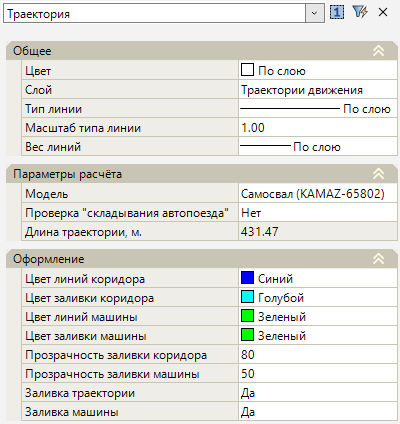

Для оценки траектории движения машины визуально в любом месте плана реализована возможность перемещения ее модели внутри коридора. Для этого выберите траекторию – нажмите на грип  – произведите перемещение модели.

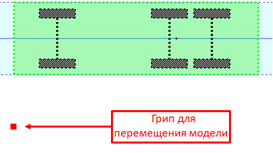

Если необходимо зафиксировать положение машины в определенном месте, то во время ее перемещения с зажатой клавишей **Shift** нажмите ЛКМ.

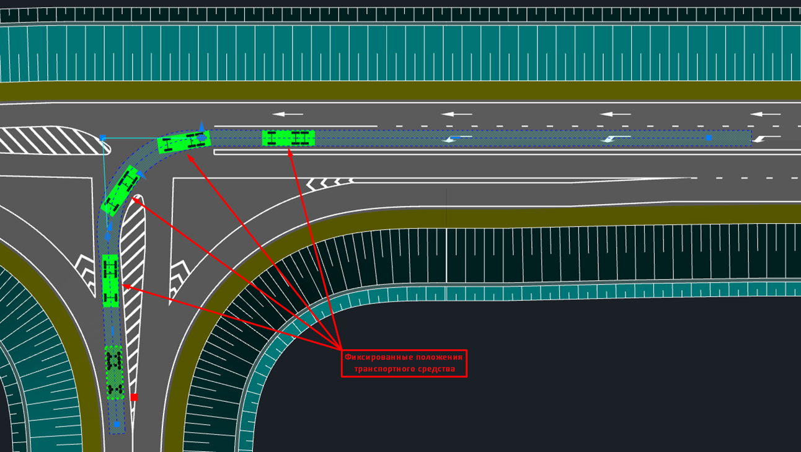

## Настройки траектории

Если для траектории необходимо изменить настройки оформления и расчета по умолчанию, выберите меню **Сервис** – **Настройка** – **Настройки траектории**:

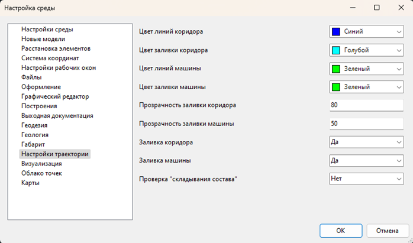

## Редактор моделей машин

Для редактирования имеющихся в библиотеке машин, а также для добавления своих, выберите меню **Задачи – Оценка траектории движения – Редактор моделей машин**. Откроется следующее окно:

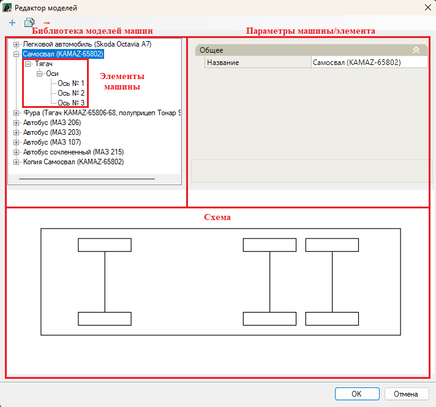

Библиотека моделей наполнена машинами, которые имеют разные геометрические характеристики (длину и ширину корпуса, длину колесной базы и т.п.) и различные ограничения (максимальный угол, внешний габаритный радиус поворота). Изменяемый в текущий момент геометрический параметр машины (или ее отдельный элемент) подсвечивается прямо на ее схеме:

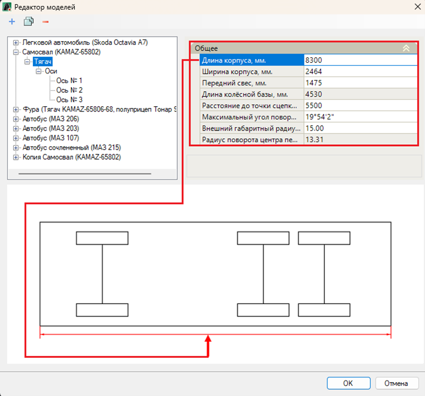

**Максимальный угол поворота** задает предельный угол поворота колес машины.

**Внешний габаритный радиус поворота** – это радиус внешней дуги при повороте машины с учетом величины ее **Переднего свеса** и **Максимального угла поворота**. Чем меньше данный показатель, тем больше маневренность ТС:

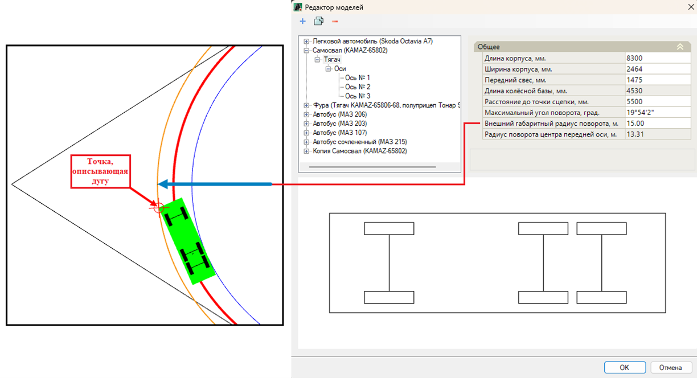

Основной элемент модели машины – это **Тягач**, который включает в себя **Оси** со своими геометрическими параметрами. Предусмотрено три вида осей: управляемые, неуправляемые и подруливающие:

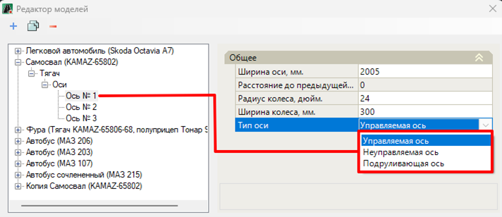

* **Управляемая** – это ось, содержащая в себе рулевые колеса.
* **Неуправляемая** – это ось, содержащая в себе нерулевые колеса.
* **Подруливающая** – это ось (как правило задняя), содержащая в себе рулевые колеса, которые поворачиваются в противоположную сторону колесам из **Управляемой оси**. Это приводит к уменьшению радиуса поворота машины.

Помимо тягача модель машины может содержать такой элемент как **Прицеп**. С помощью прицепов формируются составные модели машин (сочлененные автобусы, автопоезда и т. п.). Параметры прицепа и его осей редактируются аналогичным тягачу образом.

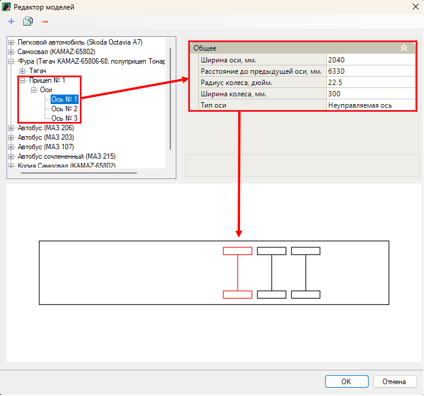

Помимо редактирования системных моделей машин и ее элементов имеется возможность добавлять свои:

* для создания новой модели машины нажмите .
* для дублирования модели машины выберите необходимую и нажмите 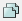.
* для удаления выбранной модели машины или ее элемента нажмите .

Каждая новая модель машины по умолчанию содержит в себе Тягач. Для добавления Прицепа выберите модель машины, нажмите по ней ПКМ – **Добавить прицеп**.

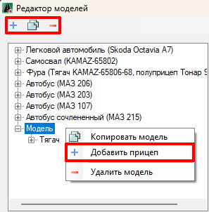

Для добавления Осей к Тягачу и Прицепу нажмите по ним ПКМ – **Добавить ось**.

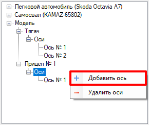

Как результат измененные и новые модели машин можно использовать для расчета траектории движения.
