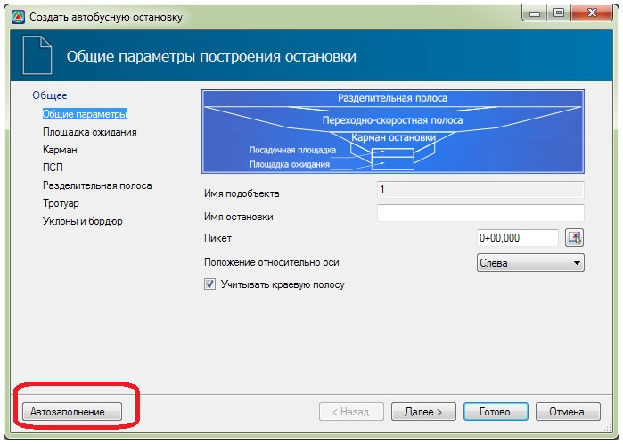
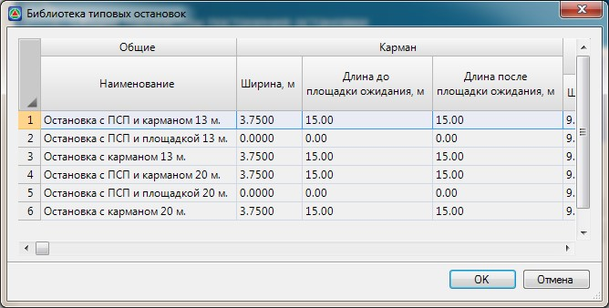
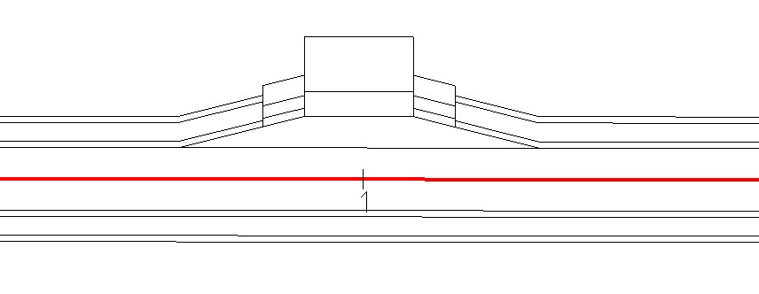

# Автоматическое задание параметров остановок

Процедура **Автозаполнения** позволяет автоматически определить параметры автобусной остановки в зависимости от ее выбранной типовой схемы. Автозаполнение доступно на любом этапе создания остановки. Однако, необходимо помнить, что при нажатии кнопки **Автозаполнение** все параметры, занесенные вручную будут пересчитаны программой. Для того чтобы применить автозаполнение, нажмите соответствующую кнопку расположенную в нижней части окна Создать автобусную остановку:

Откроется диалоговое окно выбора типовой схемы остановки:

Выберите типовую схему остановки и нажмите кнопку **ОК**. Ее параметры будут рассчитаны автоматически.



Имеется возможность создавать собственные схемы остановок и сохранять их в данную библиотеку как типовые. Для этого воспользуйтесь функцией Задачи - Остановки - Библиотека типовых остановок.



Соответственно, после процедуры **Автозаполнения**, будут заполнены основные вкладки мастера создания остановки. Такие как: **Площадка ожидания, Карман, ПСП, Разделительная полоса, Тротуар**. При необходимости данные в этих вкладках могут быть отредактированы.

Если основные параметры остановки заданы и необходимо сделать ее визуальную оценку, т.е. отрисовать ее на плане, нажмите кнопку **Готово** расположенную в нижней части окна **Создать автобусную остановку**.

В результате программа создаст автобусную остановку, добавив характерные полосы в текущую дорогу, модифицирует поперечные профили на соответствующем участке и отрисует ее в окне **План**:



Если расположение остановки не позволяет создать ее корректно с заданными параметрами, к примеру: не хватает длины дороги чтобы добавить к ней переходноскоростную полосу, то в этом случае программа выдаст соответствующие предупреждение. Все подобные сообщение отображаются в окне Список ошибок. Для открытия данного окна выберите элемент меню: Вид – Список ошибок.

