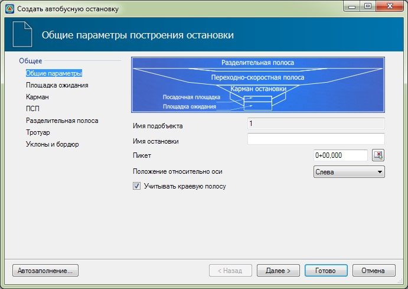

# Создание остановок

Последовательность задания и редактирования параметров остановки во многом аналогична последовательности проектирования пересечений и примыканий в одном уровне.

Для того, чтобы создать остановку:

1. Выберите элемент меню **Задачи - Остановки – Создать остановку**.
2. Курсор примет форму прицела, левой кнопкой мыши укажите подобъект дороги, на которой необходимо создать остановку.
3. Откроется диалоговое окно:

   

   **Имя остановки** - в данном поле задайте наименование создаваемой остановки.

   **Пикет** – пикетажное положение оси симметрии остановки, т.е. центра посадочной площадки.

   Для графического задания пикета автобусной остановки, нажмите кнопку . Курсор примет форму прицела, укажите левой кнопкой мыши положение оси автобусной остановке на соответствующей трассе.

   **Положение относительно оси** – в данном поле из выпадающего списка выберите сторону относительно направления пикетажа трассы, на которой будет расположена остановка.

   При включении опции **Учитывать краевую полосу** посадочная площадка остановки будет строиться относительно кромки проезжей части, при выключенной опции - относительно краевой полосы.

   Все параметры элементов остановки могут задаваться самостоятельно на соответствующих вкладках или определены автоматически из встроенной базы данных программы. Ниже рассмотрим оба перечисленных способа.