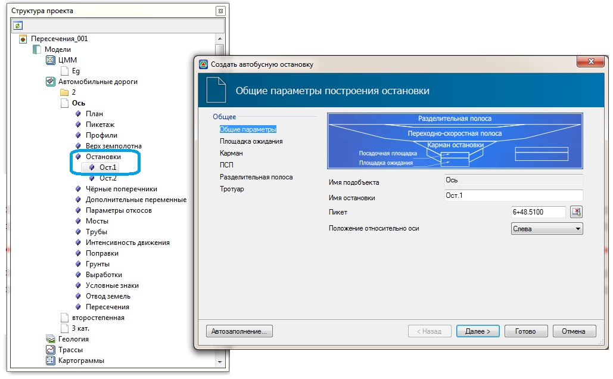
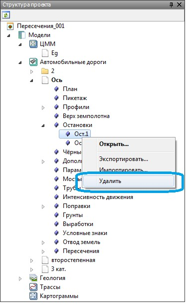
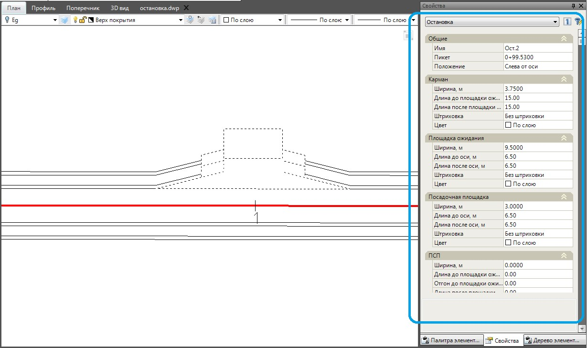

# Редактирование автобусных остановок

Редактирования параметров уже созданных остановок можно производить с помощью выше описанного мастера их создания, а также через стандартное окно свойств выбранного объекта.

* Для того чтобы изменить параметры предварительно созданной остановки через мастер остановок:

  1. Cделайте текущим подобъект, который содержит редактируемую остановку.
  2. В окне **Структура проекта**, раскройте дерево таблиц текущего подобъекта. Все созданные остановки находятся в списке с соответствующим названием. Щелкните дважды левой кнопкой мыши по наименованию остановки, которую необходимо отредактировать. Откроется стандартный мастер остановок:

     

  3. Измените необходимые параметры остановки и нажмите **ОК**. В результате, текущая остановка будет перестроена с учетом внесенных изменений.

* Для того чтобы удалить остановку:

  1. Cделайте текущим подобъект, который содержит удаляемую остановку.
  2. В окне **Структура проекта**, раскройте дерево таблиц текущего подобъекта. Все созданные остановки находятся в списке с соответствующим названием. Щелкните правой кнопкой мыши по остановке, которую необходимо удалить. Из появившегося контекстного меню выберите пункт **Удалить**:

     

В результате остановка удалится, а содержащая ее дорога будет перестроена.

* Для редактирования параметров остановки через стандартное окно **Свойства**:

  

  1. Выберите ее левой кнопкой мыши непосредственно в графическом поле окна **План**. Параметры выбранного объекта отобразятся в окне **Свойства**. 
  2. Измените в полях окна **Свойства** соответствующие параметры остановки.