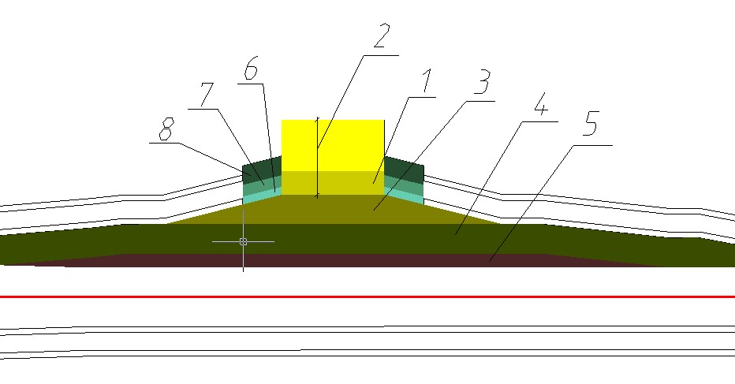

# Элементы остановки

Все элементы остановки представлены на рисунке под соответствующими номерами:

1 - Посадочная площадка.
2 - Площадка ожидания.
3 - Карман.
4 - Переходно-скоростная полоса (ПСП).
5 - Разделительная полоса.
6 - Газон.
7 - Тротуар.
8 - Обочина.
